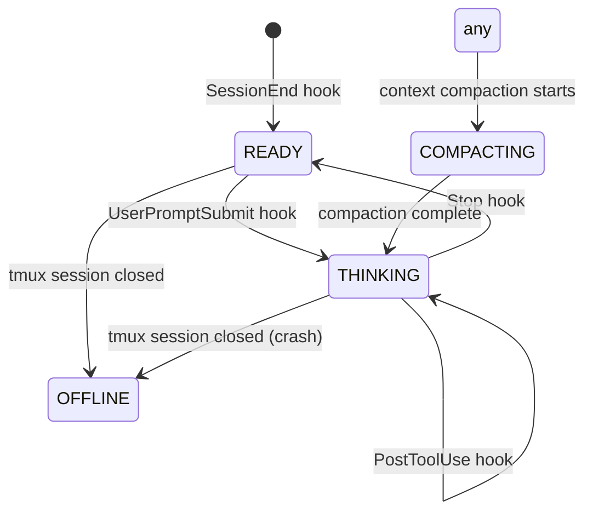

# AGM Session State Machine

## Overview

The AGM session state machine tracks the real-time status of each Claude Code session. It drives
the tmux status-line display, letting you see at a glance whether a session is idle, actively
processing, waiting for permission, or gone.

State is written by small hook binaries that Claude Code invokes at lifecycle events
(`UserPromptSubmit`, `PostToolUse`, `Stop`, `SessionEnd`). The `agm` CLI reads the state and
renders it with colour in the tmux status line. A fallback detection path handles sessions that
died without firing a hook (crash recovery).

---

## State Reference

| State              | Colour  | Meaning                                              | CLI vocab          | Old manifest constant |
|--------------------|---------|------------------------------------------------------|--------------------|-----------------------|
| `READY`            | green   | Session is at the Claude prompt, awaiting user input | `READY`            | `DONE`                |
| `THINKING`             | blue    | Claude is processing or tools are running            | `THINKING`             | `WORKING`             |
| `PERMISSION_PROMPT`| yellow  | Waiting for a tool-permission dialog                 | `PERMISSION_PROMPT`| `USER_PROMPT`         |
| `COMPACTING`       | magenta | Context compaction is in progress                    | `COMPACTING`       | *(none — new)*        |
| `OFFLINE`          | grey    | The tmux session no longer exists                    | `OFFLINE`          | *(none — new)*        |

---

## State Diagram

---

## Hook to State Mapping

| Claude Code Hook Event | Hook Binary                    | State Set    | Notes                              |
|------------------------|--------------------------------|--------------|------------------------------------|
| `UserPromptSubmit`     | `userpromptsubmit-state-reporter` | `THINKING`    | Fires when user sends a message    |
| `PostToolUse`          | `posttool-context-monitor`     | `THINKING`       | Also updates context percentage    |
| `Stop`                 | `stop-state-reporter`          | `READY`      | Fires when Claude finishes a turn  |
| `SessionEnd`           | `sessionend-state-reporter`    | `READY`      | Fires on clean session exit        |
| *(none — fresh file)*  | *(automatic fallback)*         | `THINKING`       | StatusLine file present but fresh  |
| *(none — stale + no tmux)* | *(automatic fallback)*     | `OFFLINE`    | Stale file and tmux session gone   |
| *(none — stale, tmux exists)* | *(automatic fallback)*  | `READY`      | Stale file but session still alive |

---

## Timing Guarantees

| Guarantee                                          | Value | Source                        |
|----------------------------------------------------|-------|-------------------------------|
| Maximum lag before state appears in tmux           | ~5 s  | `tmux status-interval`        |
| Context percentage staleness window                | 30 s  | `statusLineStaleTTL`          |
| Minimum interval between context updates           | 5 s   | `PostToolUse` debounce        |
| State transition latency (hook → agm CLI write)    | <100 ms | agm CLI direct write        |
| Max time stale THINKING persists after crash           | until next hook fires or tmux closes | fallback detection |

**Key implication:** after a session crashes, the status line will show `THINKING` for up to 30 s
(the stale TTL), then flip to `OFFLINE` once the fallback detector sees no tmux session. If tmux
is still alive but hooks were not installed, it flips to `READY`.

---

## Troubleshooting

### Status shows THINKING but the session is idle

The most common cause is missing hooks. Claude Code only fires lifecycle events when hooks are
configured in `~/.claude/settings.json`.

1. Verify hooks are present in `settings.json` (see `cmd/agm-hooks/README.md`).
2. Run `agm session state detect <name>` to force a fresh detection without waiting for a hook.

### Status shows READY but Claude is working

The `UserPromptSubmit` hook is missing from `settings.json`. Without it, state never transitions
to `THINKING` when the user submits a prompt.

### Status never updates

Check that `agm-statusline-capture` is configured in the `statusLine` section of `settings.json`.
Without this, the hook binaries have nowhere to write state.

### Wrong colours / unexpected state labels

The session may be using the old vocabulary (`DONE`/`WORKING`/`USER_PROMPT`). The display layer
handles both vocabularies for backward compatibility, so the state will self-heal on the next hook
fire. No manual action is required.

---

## Implementation Notes

### Vocabulary migration

The system has two vocabularies in flight:

- **Old constants** (Go manifest): `DONE`, `WORKING`, `USER_PROMPT` — used in some persisted
  state files and older hook binaries.
- **New CLI vocabulary**: `READY`, `THINKING`, `PERMISSION_PROMPT` — used by all new hook binaries
  and the `agm session state` subcommand.

The display layer maps both sets to the same colour and label, so mixed environments work
correctly. New hooks should always emit the new vocabulary. Old state files are upgraded in place
on next write.

See also: `cmd/agm-hooks/README.md` for per-binary configuration.
