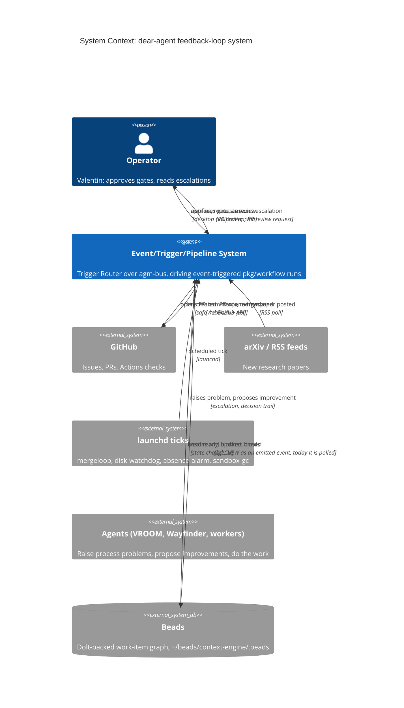
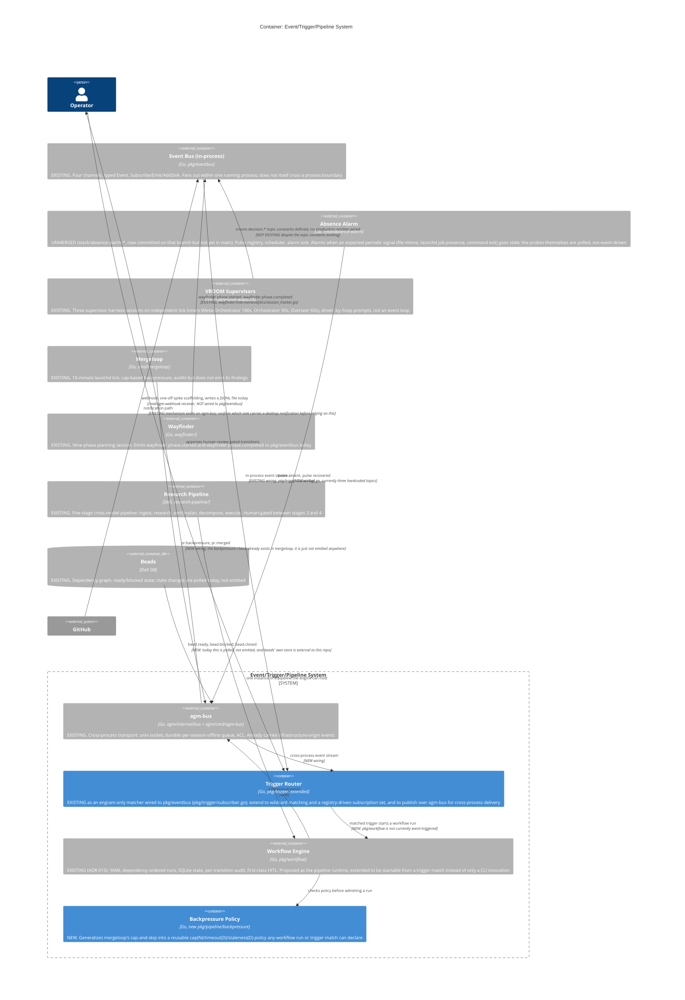
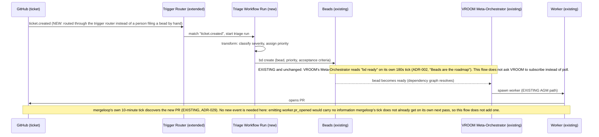

# Feedback-Loop Architecture: Diagrams

<!-- Last audited at: 2026-09-02 -->

Companion diagrams for [feedback-loop-pipelines.md](feedback-loop-pipelines.md). Two
levels use the C4 model (System Context, Container); the two example flows are
expressed as sequence diagrams instead of C4 Component diagrams, because a flow is a
temporal chain of events across several containers, not the internal structure of one
container. All diagrams are Mermaid, in fenced code blocks, and render natively on
GitHub and in Claude Artifacts.

Every `Rel()` and message below is labeled EXISTING or NEW. An EXISTING label means
the wiring runs in a production binary today, not merely that the code exists
somewhere in the tree; see [feedback-loop-pipelines.md, "What already
exists"](feedback-loop-pipelines.md#what-already-exists) for the file:line citation
behind each one.

## 1. System Context

Who talks to the feedback-loop system, and why. `Trigger Router + Event-Triggered
Workflow Runs` is the proposed addition; everything else already exists.



## 2. Container

Inside the system boundary. The cross-process transport question matters here:
`pkg/eventbus.LocalBus` is documented as "an in-process event bus implementation"
(`pkg/eventbus/local_bus.go:17`); it does not cross a process boundary on its own.
Every trigger in this document's example flows originates in a different process from
the one that should react to it (mergeloop and absence-alarm are separate launchd
one-shots; VROOM supervisors are separate harness sessions). `agm-bus`
(`agm/internal/bus`, `agm/cmd/agm-bus`) already is the cross-process transport: a
durable unix-socket broker with a per-session offline queue, already designed to carry
"side-channel observability events from infrastructure code... that originate outside
any running Claude session" (`agm/internal/bus/emitter.go`). This design routes
cross-process trigger events over `agm-bus`, and keeps `pkg/eventbus` for fan-out
inside one process.



## 3. Flow A (simple): ticket to assigned worker, as a sequence



## 4. Flow B (advanced): arXiv paper to auto-merge or human review

```mermaid
sequenceDiagram
    participant FEED as arXiv/RSS feed
    participant RT as Trigger Router (extended)
    participant RP as Research Pipeline (existing skill, hosted as a workflow run)
    participant S4 as Independent Stage 4 Reviewer (existing skill rule, a different model again)
    participant HUM as Operator
    participant EXP as Experimental Workers (existing AGM spawn)
    participant BM as Benchmark Runner (new workflow run)
    participant BP as Backpressure Policy (new)
    participant GATE as Merge Decision (illustrative only, needs its own design review)
    participant GH as GitHub

    FEED->>RT: paper.posted
    RT->>RP: match "paper.posted", start research-pipeline run
    RP->>RP: Stage 2: goal-oriented research
    RP->>RP: Stage 3: independent model verifies claims, writes a codebase-grounded plan
    RP->>HUM: present plan (EXISTING human review gate, Stage 3 to Stage 4 boundary)
    HUM-->>RP: approval receipt bound to the exact plan revision (commit SHA or content digest, per the skill's own rule)
    RP->>S4: Stage 4: a third independent model adversarially reviews the approved plan before any bead exists
    alt Stage 4 finds a blocking defect
        S4-->>RP: back to Stage 3's author to fix, then re-review, with a fresh approval receipt on the corrected revision
    else Stage 4 ships unconditionally
        S4->>RT: plan.approved
        RT->>EXP: spawn N competing experimental workers, one per candidate approach
        EXP->>BM: each worker's PR triggers benchmark.requested
        BM->>BP: check backpressure (max concurrent benchmark runs, PR-queue cap)
        BP-->>BM: admit, queue, or reject
        BM->>RT: benchmark.completed(pr, delta), one independently authored benchmark shared by all N candidates so no candidate marks its own homework
        RT->>GATE: evaluate(delta, change classification)
        Note over GATE: GATE is sketched here to show where the decision plugs in. Its actual rule needs its own design review; see feedback-loop-pipelines.md, "Auto-merge illustration."
        GATE->>GH: request human review (this document does not propose an auto-merge path that ships without that review)
    end
```

Flow B keeps the research-pipeline skill's own Stage 4 adversarial review and its
commit-SHA-bound approval receipt intact; nothing here proposes skipping either. See
[feedback-loop-pipelines.md, "Auto-merge
illustration"](feedback-loop-pipelines.md#auto-merge-illustration-not-a-decision) for
why the final gate stays a sketch rather than a shipped rule in this document.
