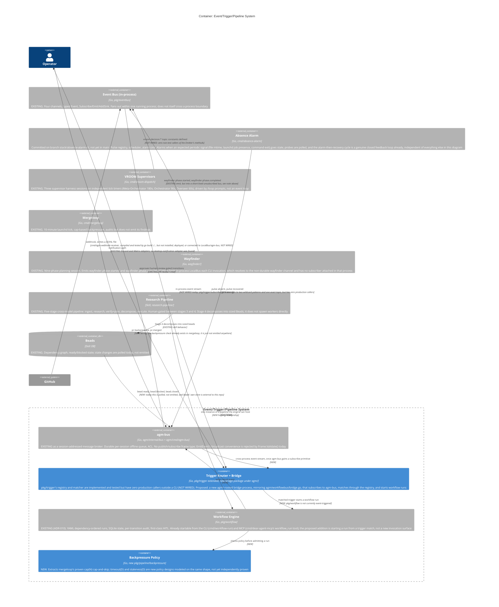
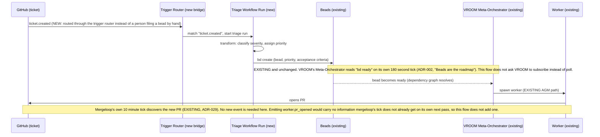

# Feedback-Loop Architecture: Diagrams

<!-- Last audited at: 2026-09-02 -->

Companion diagrams for [feedback-loop-pipelines.md](feedback-loop-pipelines.md). Two
levels use the C4 model (System Context, Container); the two example flows are
expressed as sequence diagrams instead of C4 Component diagrams, because a flow is a
temporal chain of events across several containers, not the internal structure of one
container. All diagrams are Mermaid, in fenced code blocks, and render natively on
GitHub and in Claude Artifacts.

Every `Rel()` and message carries one of three labels: EXISTING (the wiring runs in a
production binary today), NEW (proposed, does not exist), or NOT WIRED (the code
exists but nothing in a production binary currently drives it). See
[feedback-loop-pipelines.md, "What already
exists"](feedback-loop-pipelines.md#what-already-exists) for the file:line citation
behind each one.

## 1. System Context

Who talks to the feedback-loop system, and why. `Trigger Router + Event-Triggered
Workflow Runs` is the proposed addition; everything else already exists.


## 2. Container

Inside the system boundary. The cross-process transport question matters here:
`pkg/eventbus.LocalBus` is documented as "an in-process event bus implementation"
(`pkg/eventbus/local_bus.go:17`); it does not cross a process boundary on its own.
Every trigger in this document's example flows originates in a different process from
the one that should react to it (mergeloop and absence-alarm are separate launchd
one-shots; VROOM supervisors are separate harness sessions).

`agm-bus` (`agm/internal/bus`, `agm/cmd/agm-bus`) is the durable cross-process unix
socket broker this design routes trigger events over, but its wire protocol today has
no publish/subscribe primitive. Its nine frame types are `hello`, `welcome`, `send`,
`deliver`, `ack`, `error`, `permission_request`, `permission_verdict`, and `bye`
(`agm/internal/bus/wire.go`), all addressed to one session id. The convenience helper
that looks like a broadcast, `Emitter.EmitEvent`, sends a `send` frame with an empty
target; the server's `Frame.Validate()` rejects any `send` frame with an empty `To`
(`agm/internal/bus/wire.go`, `"send: missing to"`), and the client-side `Emitter`
never reads the server's response, so the rejection is invisible to the caller. The
one production caller of `EmitEvent`, the broker's own heartbeat watcher
(`agm/internal/bus/heartbeat_watcher.go`), is therefore calling a path that appears to
be silently rejected today. Because `pkg/trigger` lives at
`github.com/vbonnet/dear-agent/pkg/trigger`, outside the `agm/` prefix, it cannot
import `agm/internal/bus` directly under Go's internal-package rule; a bridge package
under `agm/` is required, the same shape `agm/workflowbus/bridge.go` already uses to
let `pkg/workflow` (also outside `agm/`) reach the same broker. This diagram shows the
proposed bridge as part of the Trigger Router container's own scope rather than as a
separate box, since it is one implementation unit: a long-lived process under `agm/`
that subscribes to `agm-bus`, matches events through `pkg/trigger`'s registry, and
starts `pkg/workflow` runs.



## 3. Flow A (simple): ticket to assigned worker, as a sequence

This flow is event-triggered choreography, not a closed feedback loop: nothing in it
measures an outcome and feeds that measurement back into a future triage decision. It
is included as the baseline case Flow B is advanced relative to.



## 4. Flow B (advanced): arXiv paper to a merge decision

Like Flow A, the plumbing shown here is event-triggered choreography. The one place a
loop actually closes in this design is separate from both flows: mergeloop's
backpressure signal (`pr.backpressure`) becoming visible enough that a future intake
decision can react to it, and the absence-alarm's alarm-then-recovery cycle, which is
already a closed loop today. See [feedback-loop-pipelines.md, "What makes a loop a
feedback loop"](feedback-loop-pipelines.md#what-makes-a-loop-a-feedback-loop) for that
distinction. Flow B routes through beads the same way Flow A does, so VROOM's ordinary
dispatch capacity, not a bespoke spawn-time check, is what keeps N candidate PRs from
all appearing on the queue at once.

```mermaid
sequenceDiagram
    participant FEED as arXiv/RSS feed
    participant RT as Trigger Router (new bridge)
    participant RP as Research Pipeline (existing skill, hosted as a workflow run)
    participant S4 as Independent Stage 4 Reviewer (existing skill rule, a different model again)
    participant HUM as Operator
    participant BD as Beads (existing)
    participant VR as VROOM (existing, same dispatch path as Flow A)
    participant WK as Candidate Worker (existing AGM path)
    participant BM as Benchmark Runner (new workflow run)
    participant BP as Backpressure Policy (new)
    participant GATE as Merge Decision (illustrative only, needs its own design review)
    participant GH as GitHub

    FEED->>RT: paper.posted
    RT->>RP: match "paper.posted", start research-pipeline run
    RP->>RP: Stage 2, goal-oriented research
    RP->>RP: Stage 3, independent model verifies claims, writes a codebase-grounded plan
    RP->>HUM: present plan (EXISTING human review gate, Stage 3 to Stage 4 boundary)
    HUM-->>RP: approval receipt bound to the exact plan revision, commit SHA or content digest, per the skill's own rule
    RP->>S4: Stage 4, a third independent model adversarially reviews the approved plan before any bead exists
    alt Stage 4 finds a blocking defect
        S4-->>RP: back to Stage 3's author to fix, then re-review, with a fresh approval receipt on the corrected revision
    else Stage 4 ships unconditionally
        S4->>BD: decompose into N sized beads, one per candidate approach, per the skill's actual Stage 4 output
        Note over BD,VR: Same mechanism as Flow A. VROOM dispatches candidate beads from its own ready queue as capacity allows, so N candidates do not all spawn workers simultaneously.
        BD-->>VR: candidate beads become ready
        VR->>WK: spawn worker per bead, as capacity allows (EXISTING AGM path)
        WK->>GH: opens candidate PR
        GH->>RT: benchmark.requested
        RT->>BM: match "benchmark.requested", start benchmark run
        BM->>BP: check backpressure, max concurrent benchmark runs
        alt admitted
            BP-->>BM: proceed
            BM->>RT: benchmark.completed(pr, delta), one independently authored benchmark shared by all N candidates so no candidate marks its own homework
            RT->>GATE: evaluate(delta, change classification)
            Note over GATE: GATE is sketched here to show where the decision plugs in. Its actual rule needs its own design review; see feedback-loop-pipelines.md, "Auto-merge illustration."
            GATE->>GH: request human review, this document does not propose a path that merges without one
        else queued
            BP-->>BM: hold until a slot frees, re-check on the next tick
        else rejected
            BP-->>BM: reject, audit the rejection the same way mergeloop audits its own cap-exceeded ticks
        end
    end
```

Flow B keeps the research-pipeline skill's own Stage 4 decomposition, its
commit-SHA-bound approval receipt, and Flow A's bead-and-VROOM dispatch path intact.
Nothing here proposes skipping any of them. See [feedback-loop-pipelines.md, "Auto-merge
illustration"](feedback-loop-pipelines.md#auto-merge-illustration-not-a-decision) for
why the final gate stays a sketch rather than a shipped rule in this document.
