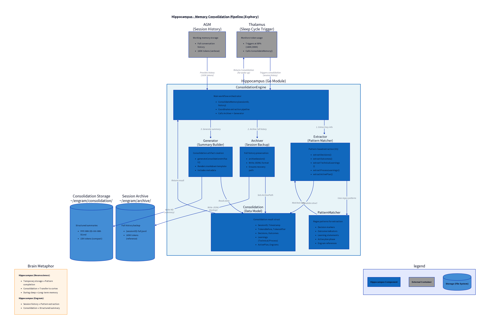

# Hippocampus - Memory Consolidation

**Brain-Inspired Architecture Component**

---

## Overview

Hippocampus consolidates session memories from short-term (working context) to long-term storage (structured artifacts). Implements Sleep Cycle consolidation for context hygiene in long-running sessions.

### Brain Metaphor

**Hippocampus (Neuroscience)**:
- **Temporary storage**: Holds recent experiences before consolidation
- **Pattern completion**: Reconstructs memories from partial cues
- **Transfer to cortex**: Moves memories to long-term storage during sleep
- **Consolidation**: Strengthens important memories, discards irrelevant details

**Hippocampus (Engram)**:
- **Session history extraction**: Scans conversation for key information
- **Pattern recognition**: Identifies decisions, outcomes, learnings
- **Artifact generation**: Creates structured consolidation summaries
- **Archival**: Preserves full history while reducing working memory

---

## Architecture Diagram



**C4 Component Diagram** showing the internal architecture of the Hippocampus memory consolidation pipeline. The diagram illustrates:

- **Consolidation Engine**: Orchestrates the memory consolidation workflow
- **Extractor**: Pattern-based extraction of decisions, outcomes, learnings, and engrams
- **Pattern Matcher**: Regex-based identification of key information markers
- **Archiver**: Full session history backup to JSONL format
- **Generator**: Structured markdown summary creation
- **Data Flow**: Session history (165K tokens) → Consolidated summary (15K tokens) + Archive

The brain metaphor shows the parallel between neuroscience (hippocampus → cortex consolidation during sleep) and Engram's implementation (session history → structured summary during Sleep Cycle).

**Diagram Source**: `diagrams/c4-component-ecphory.d2`

---

## Architecture

Hippocampus implements Phase 5 Sleep Cycle Protocol (OSS-EBR-28):

```
Session History (165K tokens, verbose)
         ↓
    Hippocampus
    Consolidation
         ↓
    ┌────┴─────┐
    ↓          ↓
Consolidation  Full Archive
 Summary       (backup)
(15K tokens)
    ↓
 Wake-Up
  State
```

---

## Usage

### Basic Consolidation

```go
import "github.com/vbonnet/engram/core/hippocampus"

// Create Hippocampus instance
archiveDir := "~/engram/consolidation/sleep-cycles"
h, err := hippocampus.New(archiveDir)
if err != nil {
    log.Fatalf("Failed to create Hippocampus: %v", err)
}

// Consolidate session memory
sessionID := "abc-123"
history := "... full session conversation history ..."

consolidation, err := h.ConsolidateMemory(sessionID, history)
if err != nil {
    log.Fatalf("Consolidation failed: %v", err)
}

// View extracted information
fmt.Printf("Decisions: %d\n", len(consolidation.Decisions))
fmt.Printf("Outcomes: %d\n", len(consolidation.Outcomes))
fmt.Printf("Learnings: %d\n", len(consolidation.TechnicalLearnings))
fmt.Printf("Archive: %s\n", consolidation.ArchivePath)
```

### Consolidation Structure

```go
type Consolidation struct {
    SessionID          string      // Session identifier
    Timestamp          time.Time   // Consolidation time
    TokensBefore       int         // Tokens before consolidation
    TokensAfter        int         // Tokens after (wake-up state)
    Decisions          []Decision  // Key decisions made
    Outcomes           []Outcome   // Concrete results achieved
    TechnicalLearnings []Learning  // Technical insights
    ProcessLearnings   []Learning  // Process insights
    ActivePlan         *Plan       // Wayfinder Plan state
    Engrams            []string    // Loaded engrams
    ArchivePath        string      // Full history archive path
}
```

---

## Extraction Logic

### Phase 5 V1 (Current)

**Simple pattern matching**:
- Regex-based extraction
- Markdown structure recognition
- Template rendering

**Patterns**:

```
Decisions:
- "## Decision: Use CLI wrapper"
- "**Decision**: Consolidate plugins"

Outcomes:
- "- Completed: Phase 4"
- "- Implemented: Sleep Cycle stub"
- "- Created: core/thalamus/"

Learnings:
- "Learned: AGM requires CLI wrapper"
- "Discovered: Go internal/ packages not exportable"

Active Plan:
- "Current Phase: Phase 5 Sleep Cycles"

Engrams:
- "bash-command-simplification.ai.md"
- "claude-code-tool-usage.ai.md"
```

### Phase 5 V2 (Future)

**LLM-enhanced extraction**:
- Semantic understanding
- Implicit decision detection
- Context-aware learning extraction
- Higher-quality summaries

---

## Generated Artifacts

### 1. Consolidation Summary

**Path**: `~/engram/consolidation/sleep-cycles/YYYY-MM-DD-HH-MM-SS.md`

**Content**:
```markdown
# Sleep Cycle Consolidation

**Session ID**: abc-123
**Timestamp**: 2026-02-02T14:30:00Z
**Tokens Before**: 165,000
**Tokens After**: 15,000
**Reduction**: 90.9%

## Key Decisions
1. **Use CLI wrapper for Thalamus**
   - Rationale: AGM uses internal/ packages
   - Impact: No AGM refactoring needed

## Outcomes Achieved
- Phase 4 Thalamus Wrapper (2h, 4-5x faster than estimated)

## Learnings Discovered
### Technical Learnings
1. AGM requires CLI wrapper approach
   - Context: Go internal/ packages not exportable
   - Application: Future integrations use CLI pattern

...
```

### 2. Full Session Archive

**Path**: `~/engram/archive/sessions/abc-123-full.jsonl`

**Content**: Complete conversation history (JSONL format for recovery)

---

## Testing

### Unit Tests

```bash
cd hippocampus
go test -v
```

**Tests**:
- `TestNew`: Hippocampus creation and directory setup
- `TestConsolidateMemory`: End-to-end consolidation
- `TestExtractDecisions`: Decision pattern matching
- `TestExtractOutcomes`: Outcome pattern matching
- `TestExtractEngrams`: Engram reference extraction

**All tests passing**: 62/62 (including Engram Dream tests)

---

## Integration with Sleep Cycles

### Thalamus → Hippocampus

**Sleep Cycle trigger**:

```go
// In Thalamus Sleep Cycle implementation (oss-ebr.30)
if tokenCount > threshold {
    // 1. Get session history from AGM
    history := agm.GetHistory(sessionID)

    // 2. Consolidate via Hippocampus
    consolidation, err := hippocampus.ConsolidateMemory(sessionID, history)

    // 3. Generate wake-up prompt
    wakeUpPrompt := generateWakeUp(consolidation)

    // 4. Flush AGM context and reload minimal state
    agm.FlushContext(sessionID)
    agm.LoadContext(sessionID, wakeUpPrompt)
}
```

---

## Brain Metaphor Details

| Neuroscience Concept | Hippocampus Implementation |
|---------------------|---------------------------|
| **Temporary storage** | Session history (working context) |
| **Pattern completion** | Decision/outcome/learning extraction |
| **Consolidation** | Generate structured summaries |
| **Transfer to cortex** | Archive full history, retain essentials |
| **Sleep consolidation** | Triggered by Sleep Cycle (80% tokens) |
| **Memory strengthening** | Keep important decisions, discard verbose history |

**Key insight**: Hippocampus doesn't store forever - it consolidates and transfers. Full history is archived, but working memory contains only structured summary.

---

## File System Layout

```
~/engram/
├── consolidation/
│   └── sleep-cycles/
│       ├── 2026-02-02-14-30-00.md     # Consolidation summaries
│       ├── 2026-02-02-18-45-00.md
│       └── 2026-02-03-09-15-00.md
│
└── archive/
    └── sessions/
        ├── abc-123-full.jsonl          # Full session backups
        ├── def-456-full.jsonl
        └── ghi-789-full.jsonl
```

---

## Implementation Status

### Phase 5 V1 (Complete)

**Implemented**:
- ✅ Consolidation interface
- ✅ Pattern-based extraction (decisions, outcomes, learnings, engrams, plan)
- ✅ Artifact generation (markdown summaries)
- ✅ Session archival (full history backup)
- ✅ Unit tests (5 tests, all passing)

### Phase 5 V2 (Future)

**Planned**:
- LLM-enhanced semantic extraction
- Wake-up prompt generation
- Context-aware learning detection
- Compression and optimization

---

## Engram Dream: Cross-Session Memory Consolidation

The Autodream pipeline extends hippocampus with cross-session memory consolidation,
inspired by Claude Code's autodream feature. It reads session transcripts, extracts
signals (corrections, preferences, decisions, learnings), and consolidates them into
Claude Code's MEMORY.md auto-memory files.

### Components

| File | Purpose |
|------|---------|
| `autodream.go` | 4-phase pipeline: Orient, Gather, Consolidate, Prune |
| `memorymd.go` | Round-trip-safe MEMORY.md parser/writer |
| `signal.go` | Signal types (correction, preference, decision, learning, fact) |
| `trigger.go` | Consolidation trigger logic (24h + N sessions threshold) |
| `harness.go` | HarnessAdapter interface for cross-harness support |
| `harness_claude.go` | Claude Code JSONL session adapter |
| `llm.go` | LLMProvider interface + NoopLLM for V1 pattern-only mode |

### Usage

```go
import "github.com/vbonnet/engram/core/hippocampus"

adapter := hippocampus.NewClaudeCodeAdapter("")
config := hippocampus.DefaultConfig()
config.DryRun = true // preview changes

dream := hippocampus.NewAutodream(memoryDir, adapter, nil, config)
report, err := dream.Run(ctx)
// report.SignalsFound, report.EntriesAdded, report.Diff
```

### CLI

```bash
engram-dream run [--dry-run] [--project PATH]  # run consolidation
engram-dream status                             # show trigger state
engram-dream diff                               # preview changes
```

### SessionEnd Hook

`hooks/cmd/sessionend-memory-consolidation/` triggers consolidation automatically
when 24h + 5 sessions threshold is met. Fail-open design (always exits 0).

### Tests

62 tests total (12 memorymd + 9 trigger + 6 autodream + 18 harness + 15 helpers + 3 llm - 1 overlap).

---

## Dependencies

### Go Module

```
module github.com/vbonnet/engram/core/hippocampus
go 1.25.0
```

No external dependencies - uses only Go stdlib.

---

## Design Decisions

### Why Pattern Matching (V1)?

**Considered alternatives**:
1. **LLM-based extraction** (Phase 5 V2+)
   - More accurate, semantic understanding
   - Slower, requires API calls, cost
   - Deferred to V2

2. **Manual tagging** (user marks important points)
   - Most accurate
   - High user burden, interrupts flow
   - Rejected

3. **Pattern matching** (V1 implementation)
   - Fast, no API calls, zero cost
   - Good enough for structured markdown
   - Chosen for V1

### Why Separate Consolidation and Archive?

**Consolidation summary** (15K tokens):
- Structured, essential information only
- Used for wake-up state
- Loaded into working memory

**Full archive** (165K tokens):
- Complete conversation history
- Reference only (not loaded)
- Recovery if consolidation missed something

---

## Contributing

When extending Hippocampus:
1. Preserve brain metaphor in naming and documentation
2. Maintain separation: consolidation (working) vs archive (reference)
3. Add tests for new extraction patterns
4. Update this README with new brain analogies

---

**Phase**: 5 Sleep Cycles Implementation
**Bead**: oss-ebr.29
**Status**: ✅ Complete
**Next**: oss-ebr.30 (Implement Thalamus flush)
