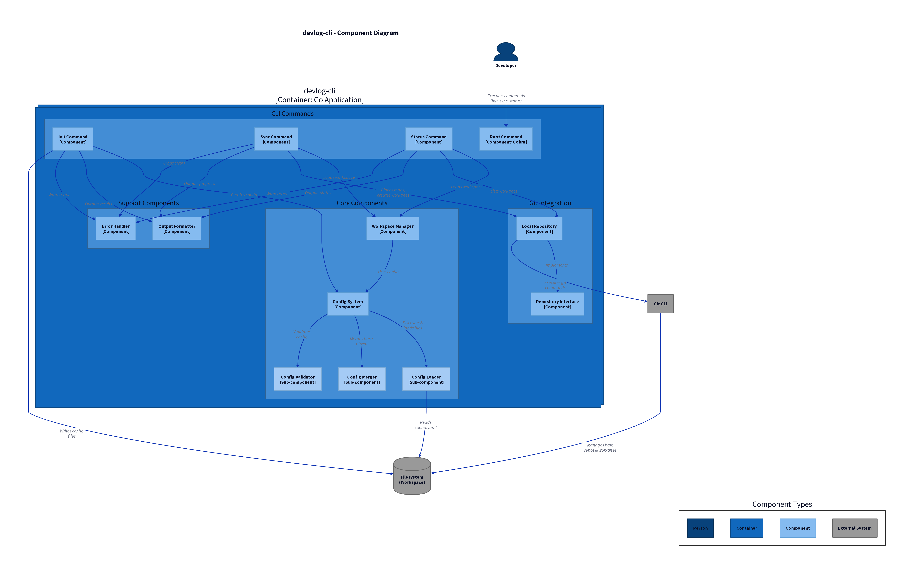

# devlog

A CLI tool for managing development workspaces using bare git repositories with multiple worktrees.

## Architecture

### C4 Component Diagram



**Component Architecture** showing the developer workspace management system:

- **EventCapture**: Captures git operations and workspace events
- **SessionTimeline**: Builds chronological session history
- **ArtifactTracker**: Tracks file changes, commits, and worktree state
- **ConfigManager**: Manages workspace configuration and sync

**Diagram Source**: `diagrams/c4-component-devlog.d2`

## Why devlog?

Managing multiple worktrees manually is tedious and error-prone. `devlog` automates:

- Cloning bare repositories across machines
- Creating and tracking worktrees
- Syncing workspace state
- Checking workspace health

Perfect for:
- **Parallel development** - Work on multiple branches simultaneously
- **Multi-machine setups** - Sync workspace config across machines
- **Team collaboration** - Share workspace structure via config files
- **Disaster recovery** - Restore workspace from config backup

## Installation

### From source

```bash
go install github.com/vbonnet/dear-agent/devlog@latest
```

### Build locally

```bash
git clone https://github.com/vbonnet/dear-agent.git
cd ai-tools/devlog-cli
go build -o devlog
```

## Quick Start

### 1. Initialize workspace

```bash
cd ~/projects
devlog init my-workspace
```

This creates `.devlog/config.yaml` with example configuration.

### 2. Configure repositories

Edit `.devlog/config.yaml`:

```yaml
name: my-workspace
description: My development workspace

repos:
  - name: engram
    url: https://github.com/vbonnet/engram.git
    type: bare
    worktrees:
      - name: main
        branch: main
      - name: feature-x
        branch: feature/new-feature
```

### 3. Sync workspace

```bash
devlog sync
```

This clones bare repositories and creates all configured worktrees.

### 4. Check status

```bash
devlog status
```

Shows which repos are cloned and which worktrees exist.

## Commands

### `devlog init [workspace-name]`

Initialize a new workspace with example configuration.

**Options:**
- `--force` - Overwrite existing configuration

**Example:**
```bash
devlog init my-workspace
devlog init --force  # Recreate config
```

### `devlog sync`

Clone missing repositories and create missing worktrees from config.

**Options:**
- `--dry-run` - Show what would happen without making changes
- `--verbose` - Show detailed progress

**Example:**
```bash
devlog sync              # Clone and create
devlog sync --dry-run    # Preview changes
devlog sync --verbose    # Detailed output
```

**Behavior:**
- Idempotent - safe to run multiple times
- Skips existing repos and worktrees
- Creates only what's missing

### `devlog status`

Show workspace state: which repos are cloned, which worktrees exist, current branches.

**Example:**
```bash
devlog status
```

**Output:**
```
Workspace: my-workspace

✓ engram (cloned)
  ✓ main → main
  ✓ feature-x → feature/new-feature

✗ dotfiles (not cloned)
  - main → main (pending)

Summary:
  Repositories: 2 configured, 1 cloned
  Worktrees: 3 configured, 2 created

Run 'devlog sync' to create missing repos and worktrees
```

## Configuration

### Config file structure

`.devlog/config.yaml`:

```yaml
name: workspace-name
description: Optional workspace description

repos:
  - name: repo-name           # Directory name
    url: https://...          # Git remote URL
    type: bare                # Always 'bare'
    worktrees:
      - name: main            # Worktree directory name
        branch: main          # Git branch to checkout
      - name: develop
        branch: develop
```

### Config discovery

`devlog` searches for `.devlog/config.yaml` by walking up from current directory.

**Example:**
```
~/projects/
  .devlog/config.yaml    # Found here
  engram/
    main/                # devlog works from anywhere under ~/projects/
```

### Local overrides

Create `.devlog/config.local.yaml` for machine-specific settings (git-ignored by default):

```yaml
repos:
  - name: engram
    worktrees:
      - name: local-feature
        branch: feature/local-only
```

Local config merges with base config.

## Examples

### Solo developer: local machine

```yaml
name: personal-workspace
repos:
  - name: website
    url: https://github.com/me/website.git
    type: bare
    worktrees:
      - name: main
        branch: main
      - name: redesign
        branch: feature/redesign
```

```bash
devlog sync              # Clone and create worktrees
cd website/main          # Work on main
cd ../redesign           # Switch to redesign branch
```

### Solo developer: multi-machine

Same config on laptop and desktop:

```bash
# On laptop
devlog init my-workspace
# Edit config, commit to dotfiles repo
git add .devlog/config.yaml
git commit -m "Add workspace config"

# On desktop
git pull  # Get config from dotfiles
devlog sync  # Clone all repos and create worktrees
```

### Team: shared workspace structure

Team shares `.devlog/config.yaml` via git:

```yaml
name: team-workspace
repos:
  - name: backend
    url: https://github.com/team/backend.git
    type: bare
    worktrees:
      - name: main
        branch: main
      - name: staging
        branch: staging
```

Each developer adds local worktrees via `.devlog/config.local.yaml`:

```yaml
repos:
  - name: backend
    worktrees:
      - name: alice-feature
        branch: feature/alice-work
```

## Workflow Patterns

### Parallel feature development

Work on multiple features simultaneously without branch switching:

```bash
cd project/main          # Review PR
cd ../feature-a          # Work on feature A
cd ../feature-b          # Work on feature B
```

No `git stash`, no `git checkout` - each worktree is independent.

### Code review workflow

Keep `main` for reviews, separate worktrees for work:

```yaml
worktrees:
  - name: main
    branch: main         # Always clean for reviews
  - name: work
    branch: develop      # Daily work here
```

### Release preparation

Maintain separate worktrees for release branches:

```yaml
worktrees:
  - name: main
    branch: main
  - name: v1.x
    branch: release/v1.x
  - name: v2.x
    branch: release/v2.x
```

## Global Flags

All commands support:

- `--config <path>` - Use alternate config file (default: `.devlog/config.yaml`)
- `--dry-run` - Show what would happen without doing it
- `--verbose` - Show detailed output
- `--help` - Show command help

## Development

### Run tests

```bash
go test ./...
```

### Test coverage

```bash
go test -cover ./...
```

### Build

```bash
go build -o devlog
```

## Architecture

```
devlog-cli/
├── cmd/devlog/          # CLI commands (init, sync, status)
│   ├── root.go          # Root command setup
│   ├── init.go          # Initialize workspace
│   ├── sync.go          # Sync repos and worktrees
│   └── status.go        # Show workspace status
├── internal/
│   ├── config/          # Config loading and merging
│   ├── git/             # Git operations (clone, worktree)
│   ├── output/          # Formatted output
│   ├── workspace/       # Workspace management
│   └── errors/          # Error types
└── main.go              # Entry point
```

### Design principles

- **Idempotent** - Safe to run sync multiple times
- **Declarative** - Config describes desired state
- **Composable** - Commands work together
- **Testable** - 83% test coverage
- **Git-native** - Uses standard git bare + worktree features

## Limitations

- **Bare repos only** - Does not support regular git repos (by design)
- **No worktree removal** - Use `git worktree remove` manually (future: `devlog clean`)
- **No branch switching** - Use `git checkout` in worktree (future: `devlog switch`)
- **No remote operations** - Use `git fetch`/`git pull` in worktrees (future: `devlog update`)

## Roadmap

- [ ] `devlog clean` - Remove worktrees not in config
- [ ] `devlog update` - Pull latest changes in all worktrees
- [ ] `devlog switch` - Switch branch in worktree
- [ ] Shell completion (bash, zsh, fish)
- [ ] Config validation with helpful errors
- [ ] Interactive init with prompts

## Related Tools

- [git-worktree](https://git-scm.com/docs/git-worktree) - Native git worktree support
- [mr](https://myrepos.branchable.com/) - Multiple repository tool
- [vcsh](https://github.com/RichiH/vcsh) - Config management via git

## License

MIT

## Contributing

Contributions welcome! Please open an issue first to discuss proposed changes.

---

**Generated with** [Claude Code](https://claude.com/claude-code)
