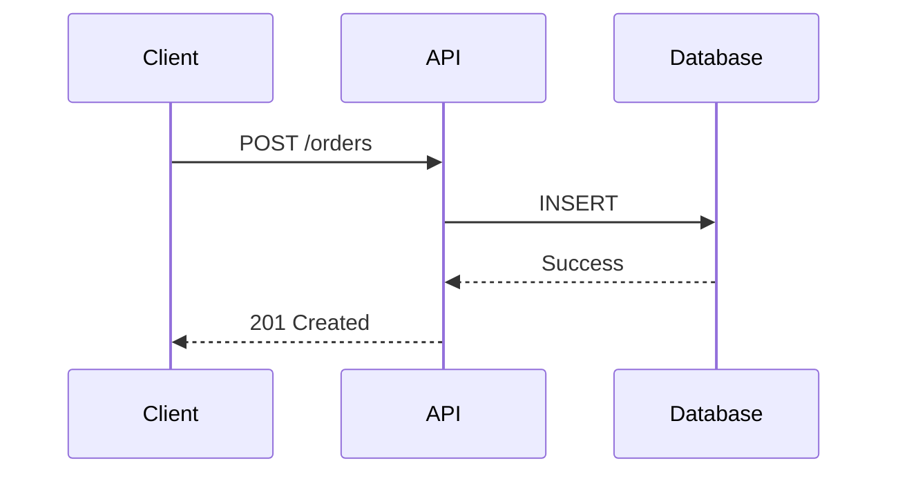

# Diagram-as-Code Best Practices

Comprehensive best practices for creating, organizing, and maintaining architecture diagrams using diagram-as-code tools.

## Table of Contents

1. [Tool Selection](#tool-selection)
2. [Project Structure](#project-structure)
3. [Naming Conventions](#naming-conventions)
4. [Diagram Organization](#diagram-organization)
5. [Version Control](#version-control)
6. [CI/CD Integration](#cicd-integration)
7. [Documentation Integration](#documentation-integration)
8. [Team Collaboration](#team-collaboration)
9. [Maintenance & Updates](#maintenance--updates)
10. [Performance & Optimization](#performance--optimization)

---

## Tool Selection

### When to Use D2

**✅ Best for**:
- C4 Context and Container diagrams
- General architecture diagrams
- Deployment diagrams
- Infrastructure diagrams
- System landscapes

**Advantages**:
- Clean, minimal syntax
- Fast rendering
- Multiple layout engines (ELK, Dagre, TALA)
- Good for code generation
- Active development

**Example Use Case**:
```d2
# Microservices architecture
API Gateway -> User Service: Authenticates
API Gateway -> Order Service: Routes requests
Order Service -> PostgreSQL: Stores orders
```

---

### When to Use Structurizr DSL

**✅ Best for**:
- Pure C4 Model implementations
- Large enterprise architectures
- Multiple related diagrams (workspace management)
- Strong C4 compliance requirements
- Model/views separation

**Advantages**:
- C4 Model native
- Workspace organization
- Multiple views from one model
- Strong typing
- Good for large teams

**Example Use Case**:
```
workspace {
  model {
    user = person "User"
    system = softwareSystem "E-Commerce"
    user -> system "Uses"
  }

  views {
    systemContext system {
      include *
    }
  }
}
```

---

### When to Use Mermaid

**✅ Best for**:
- Sequence diagrams
- Flowcharts
- State diagrams
- Documentation in Markdown
- GitHub README diagrams

**Advantages**:
- Markdown embedding
- GitHub native rendering
- Live editor
- Growing C4 support
- Simple syntax

**Example Use Case**:
````markdown
# API Flow


````

---

### Decision Matrix

| Criteria | D2 | Structurizr DSL | Mermaid |
|----------|-----|-----------------|---------|
| **C4 Context** | ⭐⭐⭐ | ⭐⭐⭐ | ⭐⭐ |
| **C4 Container** | ⭐⭐⭐ | ⭐⭐⭐ | ⭐⭐ |
| **C4 Component** | ⭐⭐⭐ | ⭐⭐ | ⭐ |
| **Sequence** | ⭐ | ⭐ | ⭐⭐⭐ |
| **Flowcharts** | ⭐⭐ | ⭐ | ⭐⭐⭐ |
| **Learning Curve** | Easy | Medium | Easy |
| **Rendering Speed** | Fast | Medium | Fast |
| **GitHub Support** | No | No | Yes |

---

## Project Structure

### Recommended Directory Layout

```
project/
├── diagrams/                        # All diagram source files
│   ├── README.md                    # Rendering instructions
│   ├── c4-context.d2                # System context (Level 1)
│   ├── c4-container.d2              # Container view (Level 2)
│   ├── components/                  # Component diagrams (Level 3)
│   │   ├── order-service.d2
│   │   ├── user-service.d2
│   │   └── payment-service.d2
│   ├── infrastructure/              # Deployment/infra diagrams
│   │   ├── deployment-prod.d2
│   │   ├── deployment-staging.d2
│   │   └── network.d2
│   ├── sequences/                   # Sequence diagrams
│   │   ├── checkout-flow.mmd
│   │   ├── authentication.mmd
│   │   └── payment-flow.mmd
│   └── rendered/                    # Generated images (PNG/SVG)
│       ├── c4-context.png
│       ├── c4-container.svg
│       └── ...
│
├── docs/
│   ├── ARCHITECTURE.md              # References diagrams/
│   └── adr/
│       └── 001-architecture.md      # ADR with diagram links
│
├── .d2-config.yaml                  # D2 rendering config
└── .github/
    └── workflows/
        └── render-diagrams.yml      # CI/CD automation
```

---

### Alternative Structure (Large Projects)

```
project/
├── architecture/                    # All architecture docs and diagrams
│   ├── c4/
│   │   ├── context.d2
│   │   ├── containers.d2
│   │   └── components/
│   ├── infrastructure/
│   │   ├── production.d2
│   │   └── staging.d2
│   ├── sequences/
│   │   └── *.mmd
│   ├── decisions/                   # ADRs
│   │   └── *.md
│   └── rendered/
│       └── *.png
│
└── src/                             # Code
```

---

## Naming Conventions

### File Names

**✅ Good**:
- `c4-context.d2` - C4 level prefix
- `c4-container-ecommerce.d2` - Specific system
- `c4-component-order-service.d2` - Component detail
- `deployment-production.d2` - Purpose clear
- `sequence-checkout-flow.mmd` - Type + purpose

**❌ Bad**:
- `diagram1.d2` - Generic, no context
- `architecture.d2` - Too vague
- `new-diagram-final-v2.d2` - Version in name
- `Diagram (1).d2` - Auto-generated name

### Naming Pattern

```
{type}-{scope}-{detail}.{extension}

Examples:
c4-context.d2                   # C4 context diagram
c4-container-platform.d2         # C4 container for "platform"
c4-component-api-gateway.d2      # C4 component for "api-gateway"
deployment-production.d2         # Production deployment
sequence-user-login.mmd          # Login sequence
network-vpc-architecture.d2      # Network architecture
```

---

### Element Naming

**✅ Good Element Names**:
- "User Service" (descriptive, clear)
- "PostgreSQL Database" (specific technology)
- "Payment Gateway API" (purpose + type)
- "Order Event Queue" (what it does)

**❌ Bad Element Names**:
- "Service 1" (generic)
- "Database" (not specific enough)
- "API" (too vague)
- "Component" (no information)

---

## Diagram Organization

### C4 Model Hierarchy

```
diagrams/
├── c4-context.d2                # Level 1: System context (always)
├── c4-container.d2              # Level 2: Containers (recommended)
└── components/                  # Level 3: Components (as needed)
    ├── api-gateway.d2           # Complex containers only
    ├── order-service.d2
    └── payment-service.d2
```

**Rule**: Don't create Level 3 diagrams for simple containers

---

### By Domain (Large Projects)

```
diagrams/
├── user-management/
│   ├── c4-context.d2
│   ├── c4-container.d2
│   └── sequences/
│       └── authentication.mmd
│
├── order-processing/
│   ├── c4-context.d2
│   ├── c4-container.d2
│   └── components/
│       └── order-service.d2
│
└── payment-processing/
    ├── c4-context.d2
    └── c4-container.d2
```

**Rule**: One domain per directory, complete C4 stack per domain

---

### By Stakeholder (Enterprise)

```
diagrams/
├── executive/                   # High-level for executives
│   └── system-landscape.d2
│
├── architect/                   # Detailed for architects
│   ├── c4-container.d2
│   └── deployment.d2
│
├── developer/                   # Implementation details
│   ├── components/
│   └── sequences/
│
└── operations/                  # Infrastructure
    └── deployment-production.d2
```

**Rule**: Filter by audience to avoid overwhelming stakeholders

---

## Version Control

### What to Commit

**✅ Always Commit**:
- Source diagram files (`.d2`, `.dsl`, `.mmd`)
- `README.md` with rendering instructions
- Configuration files (`.d2-config.yaml`)
- CI/CD workflows

**❓ Optional**:
- Rendered images (`rendered/*.png`, `rendered/*.svg`)
  - **Pros**: Easy to view in PRs
  - **Cons**: Binary files, large diffs, merge conflicts
  - **Recommendation**: Commit if < 100KB each

**❌ Never Commit**:
- Temporary files (`.tmp`, `.cache`)
- Tool-specific build artifacts
- API keys or secrets in diagram descriptions

---

### .gitignore

```gitignore
# Rendered diagrams (optional - only if using CI rendering)
diagrams/rendered/*.png
diagrams/rendered/*.svg

# Temporary files
*.tmp
*.cache
.d2-cache/

# Tool artifacts
.structurizr/
plantuml-cache/
```

---

### Commit Messages

**✅ Good**:
```
docs: Add C4 container diagram for order service

- Shows microservices architecture
- Includes database and message queue
- Renders to diagrams/rendered/

Refs: #123
```

**❌ Bad**:
```
Update diagram
```

---

### Branching Strategy

**Feature Branches**:
```
feat/add-payment-service-diagram
docs/update-architecture-diagrams
refactor/split-monolith-diagram
```

**Review Process**:
1. Create PR with diagram changes
2. CI renders diagrams automatically
3. Reviewers see visual diff
4. Approve and merge

---

## CI/CD Integration

### GitHub Actions Example

```yaml
name: Render Diagrams

on:
  pull_request:
    paths:
      - 'diagrams/**/*.d2'
      - 'diagrams/**/*.mmd'

jobs:
  render:
    runs-on: ubuntu-latest
    steps:
      - uses: actions/checkout@v4

      - name: Install D2
        run: go install oss.terrastruct.com/d2@latest

      - name: Install Mermaid CLI
        run: npm install -g @mermaid-js/mermaid-cli

      - name: Render diagrams
        run: |
          d2 diagrams/**/*.d2 diagrams/rendered/
          mmdc -i diagrams/sequences/*.mmd -o diagrams/rendered/

      - name: Upload artifacts
        uses: actions/upload-artifact@v4
        with:
          name: rendered-diagrams
          path: diagrams/rendered/
```

---

### Pre-Commit Hook

```bash
#!/bin/bash
# .git/hooks/pre-commit

# Validate D2 syntax
for file in $(git diff --cached --name-only | grep '\.d2$'); do
  d2 compile --dry-run "$file" || exit 1
done

# Validate Mermaid syntax
for file in $(git diff --cached --name-only | grep '\.mmd$'); do
  mmdc --quiet --input "$file" --output /dev/null || exit 1
done

echo "✓ Diagram syntax valid"
```

---

### Automated Rendering

**Option 1**: Commit rendered images

```bash
# Render on commit
d2 diagrams/*.d2 diagrams/rendered/
git add diagrams/rendered/
git commit -m "Render updated diagrams"
```

**Option 2**: Render on demand

```bash
# Render locally when needed
npm run render-diagrams
# or
make diagrams
```

**Recommendation**: Option 2 (render on demand) for most projects

---

## Documentation Integration

### Linking Diagrams in Markdown

**Relative Paths**:
```markdown
# Architecture

## System Context


See [source diagram](diagrams/c4-context.d2) for editable version.
```

**With Caption**:
```markdown
<figure>
  
  <figcaption>Figure 1: Container diagram showing microservices</figcaption>
</figure>
```

---

### ARCHITECTURE.md Template

```markdown
# Architecture

## System Context


Our e-commerce platform interacts with:
- Customers (via web and mobile apps)
- Payment Gateway (Stripe)
- Inventory System (legacy REST API)

## Container Architecture


Key containers:
- **API Gateway**: Entry point (Kong)
- **User Service**: Authentication (Node.js)
- **Order Service**: Order management (Python)
- **PostgreSQL**: Primary data store

## Diagram Sources

All diagrams are version-controlled in `diagrams/`:
- [c4-context.d2](diagrams/c4-context.d2)
- [c4-container.d2](diagrams/c4-container.d2)

To render locally:
```bash
d2 diagrams/*.d2 diagrams/rendered/
```
```

---

### ADR Integration

```markdown
# ADR-003: Adopt Microservices Architecture

## Decision

We will adopt a microservices architecture with domain-driven design.

## Architecture


See [container diagram source](../diagrams/c4-container.d2).

## Consequences

- Services can scale independently
- Team autonomy per service
- Increased operational complexity
```

---

## Team Collaboration

### Ownership Model

**Option 1**: Centralized (Recommended for Small Teams)
- Architecture team owns all diagrams
- Developers submit PRs for changes
- Ensures consistency

**Option 2**: Distributed (Recommended for Large Teams)
- Each team owns their domain diagrams
- Architecture team reviews for consistency
- Faster updates

---

### Code Review Checklist

**Diagram PR Review**:
- [ ] Diagram follows C4 Model conventions
- [ ] Element names are descriptive
- [ ] Technology stack is accurate
- [ ] Relationships are correctly labeled
- [ ] Diagram renders without errors
- [ ] Legend is present (if needed)
- [ ] Documentation updated (ARCHITECTURE.md)
- [ ] Passes visual regression tests (if applicable)

---

### Style Guide

Create a `diagrams/STYLE_GUIDE.md`:

```markdown
# Diagram Style Guide

## Colors

- Person: Blue (#08427b)
- Our Systems: Blue (#1168bd)
- External Systems: Gray (#999999)
- Databases: Light Blue (#438dd5)
- Message Queues: Orange (#ff9f43)

## Shapes

- Person: `{shape: person}`
- Database: `{shape: cylinder}`
- Queue: `{shape: queue}`

## Naming

- Use Title Case for element names
- Include technology in parentheses: "API Server (Node.js)"
- Be specific: "PostgreSQL" not "Database"

## Layout

- Prefer `direction: right` for horizontal flow
- Use `near` sparingly for manual positioning
- Let auto-layout do its job
```

---

## Maintenance & Updates

### Update Triggers

**Update diagrams when**:
- Adding new services/containers
- Removing services/containers
- Changing technology stack
- Modifying relationships/dependencies
- Architecture decision recorded (ADR)

**Don't update for**:
- Minor code refactoring
- Bug fixes
- Configuration changes
- Non-architectural changes

---

### Diagram Sync Workflow

```bash
# 1. Check for drift
diagram-sync diagrams/c4-container.d2 src/

# 2. If drift detected, update diagram
vim diagrams/c4-container.d2

# 3. Re-render
d2 diagrams/c4-container.d2 diagrams/rendered/c4-container.png

# 4. Verify sync
diagram-sync diagrams/c4-container.d2 src/

# 5. Commit
git add diagrams/c4-container.d2 diagrams/rendered/c4-container.png
git commit -m "docs: Update container diagram for new payment service"
```

---

### Deprecation Strategy

**When removing old diagrams**:
1. Move to `diagrams/archive/` directory
2. Update documentation to remove references
3. Keep for 1-2 months before deleting
4. Document reason in commit message

```bash
git mv diagrams/old-architecture.d2 diagrams/archive/
git commit -m "docs: Archive old architecture diagram (replaced by c4-container.d2)"
```

---

## Performance & Optimization

### Diagram Complexity

**Keep diagrams focused**:
- ✅ Context: 5-10 elements
- ✅ Container: 10-20 elements
- ✅ Component: 8-15 elements

**If too complex**:
- Split into multiple diagrams
- Create filtered views
- Use composition (nested diagrams)

---

### Rendering Performance

**D2 Layout Engine Choice**:
```bash
# ELK - Best for complex layouts (default)
d2 --layout elk diagram.d2

# Dagre - Faster, simpler layouts
d2 --layout dagre diagram.d2

# TALA - Experimental, aesthetic
d2 --layout tala diagram.d2
```

**Benchmark**:
- Small (< 10 elements): All engines ~1 second
- Medium (10-30 elements): ELK ~2-3 seconds, Dagre ~1 second
- Large (30+ elements): ELK ~5-10 seconds, Dagre ~2-3 seconds

---

### Caching Strategy

**CI/CD Caching**:
```yaml
- name: Cache rendered diagrams
  uses: actions/cache@v4
  with:
    path: diagrams/rendered/
    key: diagrams-${{ hashFiles('diagrams/**/*.d2') }}
```

**Local Caching**:
```bash
# Only render changed diagrams
for file in $(git diff --name-only main HEAD | grep '\.d2$'); do
  d2 "$file" "diagrams/rendered/$(basename $file .d2).png"
done
```

---

## Quick Reference

### Checklist for New Diagrams

- [ ] Choose appropriate tool (D2/Structurizr/Mermaid)
- [ ] Follow naming convention (`c4-{level}-{detail}.{ext}`)
- [ ] Place in correct directory (`diagrams/`)
- [ ] Include legend (if needed)
- [ ] Add descriptions to elements
- [ ] Test rendering locally
- [ ] Update ARCHITECTURE.md
- [ ] Create PR with visual diff
- [ ] Run diagram-sync (if applicable)

---

### Common Commands

```bash
# Render single diagram
d2 diagrams/c4-context.d2 diagrams/rendered/c4-context.png

# Render all D2 diagrams
d2 diagrams/**/*.d2 diagrams/rendered/

# Render Mermaid diagrams
mmdc -i diagrams/sequences/*.mmd -o diagrams/rendered/

# Validate syntax
d2 compile --dry-run diagrams/c4-context.d2

# Check diagram-code sync
diagram-sync diagrams/c4-container.d2 src/

# Review diagram quality
review-diagrams diagrams/c4-context.d2
```

---

**Document Version**: 1.0
**Last Updated**: 2026-03-13
**Maintained by**: Engram Team
