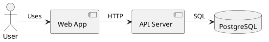
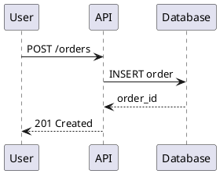
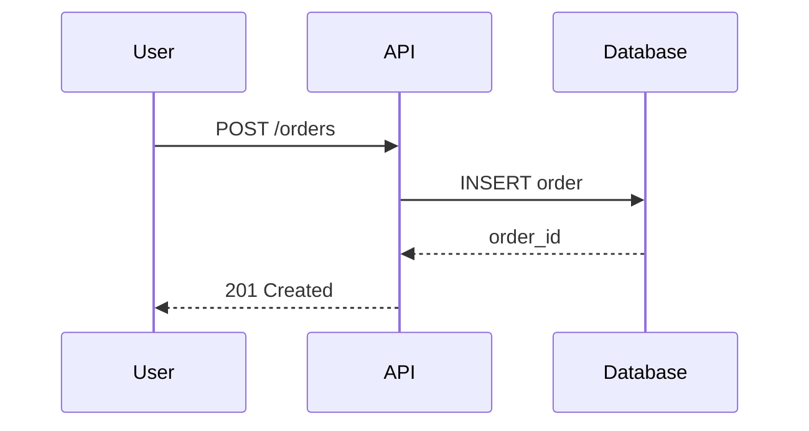

# Migrating from PlantUML to Modern Diagram-as-Code

A practical guide for teams moving from PlantUML to D2, Structurizr DSL, or Mermaid.

## Table of Contents

1. [Why Migrate?](#why-migrate)
2. [Migration Strategy](#migration-strategy)
3. [Syntax Comparison](#syntax-comparison)
4. [Migration Steps](#migration-steps)
5. [Tool Recommendations](#tool-recommendations)
6. [Common Patterns](#common-patterns)
7. [Troubleshooting](#troubleshooting)

---

## Why Migrate?

### Limitations of PlantUML

**Dated Syntax**:
- Verbose boilerplate (`@startuml` / `@enduml`)
- Complex syntax for simple diagrams
- Difficult to read and maintain

**Technology Stack**:
- Requires Java runtime (JVM dependency)
- Slower rendering than modern tools
- Limited layout engine options

**Community & Ecosystem**:
- Slower development pace
- Limited modern integrations
- Fewer CI/CD tools

### Benefits of Modern Tools

**D2**:
- ✅ Clean, minimal syntax
- ✅ Native Go (no JVM)
- ✅ Multiple layout engines (ELK, Dagre, TALA)
- ✅ Fast rendering
- ✅ Active development

**Structurizr DSL**:
- ✅ C4 Model native
- ✅ Model/views separation
- ✅ Strong typing
- ✅ Workspace management

**Mermaid**:
- ✅ Markdown integration
- ✅ GitHub rendering support
- ✅ Live editor
- ✅ Growing C4 support

---

## Migration Strategy

### Phased Approach (Recommended)

**Phase 1: New Diagrams** (Week 1)
- Start all new diagrams in D2/Structurizr/Mermaid
- Don't touch existing PlantUML diagrams yet
- Build team familiarity with new tools

**Phase 2: High-Value Diagrams** (Week 2-3)
- Migrate frequently-updated diagrams
- Migrate diagrams used in documentation
- Migrate C4 Context/Container diagrams

**Phase 3: Long Tail** (Month 2)
- Migrate remaining diagrams over time
- Archive obsolete diagrams
- Remove PlantUML tooling

### Big Bang Approach (Not Recommended)

❌ Don't migrate everything at once unless:
- You have < 10 diagrams total
- All diagrams are simple
- You have dedicated migration time

---

## Syntax Comparison

### Basic Component Diagram

#### PlantUML


#### D2 (Recommended)
```d2
User: {shape: person}
Web App
API Server
PostgreSQL: {shape: cylinder}

User -> Web App: Uses
Web App -> API Server: HTTP
API Server -> PostgreSQL: SQL
```

**Key Differences**:
- ❌ No `@startuml` / `@enduml` boilerplate
- ✅ Cleaner syntax
- ✅ Implicit element creation
- ✅ Shape attributes inline

---

### C4 Context Diagram

#### PlantUML (C4-PlantUML)
```plantuml
@startuml
!include https://raw.githubusercontent.com/plantuml-stdlib/C4-PlantUML/master/C4_Context.puml

Person(customer, "Customer", "A customer of the system")
System(ecommerce, "E-Commerce Platform", "Allows customers to purchase products")
System_Ext(payment, "Payment Gateway", "Processes payments")

Rel(customer, ecommerce, "Browses and purchases")
Rel(ecommerce, payment, "Processes payments via")
@enduml
```

#### D2 (Clean)
```d2
customer: {
  label: Customer
  shape: person
  description: A customer of the system
}

ecommerce: {
  label: E-Commerce Platform
  description: Allows customers to purchase products
}

payment: {
  label: Payment Gateway
  description: Processes payments
  style.fill: "#999999"  # External system
}

customer -> ecommerce: Browses and purchases
ecommerce -> payment: Processes payments via
```

**Key Differences**:
- ❌ No external `!include` dependencies
- ✅ Self-contained diagram
- ✅ No special C4 macros needed
- ✅ Nested properties

---

### Sequence Diagram

#### PlantUML


#### Mermaid (Best for Sequence)


**Key Differences**:
- ✅ Similar syntax for sequence diagrams
- ✅ Mermaid has better GitHub support
- ✅ Renders in Markdown files

---

## Migration Steps

### Step 1: Inventory Your Diagrams

Create a spreadsheet with:

| File | Type | Last Updated | Frequency of Changes | Priority |
|------|------|--------------|----------------------|----------|
| docs/architecture.puml | Component | 2024-01 | High | High |
| docs/deployment.puml | Deployment | 2023-06 | Low | Low |
| docs/sequence.puml | Sequence | 2024-03 | Medium | High |

**Prioritize by**:
- Frequency of updates (high = migrate first)
- Visibility (docs, READMEs = migrate first)
- Complexity (simple = migrate first)

---

### Step 2: Choose Target Format

**Use D2 when**:
- General architecture diagrams
- C4 Context/Container diagrams
- Need fast rendering
- Want clean syntax

**Use Structurizr DSL when**:
- Pure C4 Model diagrams
- Need workspace management
- Want strong C4 compliance
- Enterprise architecture

**Use Mermaid when**:
- Sequence diagrams
- Flowcharts
- Embedding in Markdown
- GitHub rendering important

---

### Step 3: Manual Conversion

For each diagram:

1. **Create new file**: `diagram.d2` (instead of `diagram.puml`)
2. **Copy element names**: Actors, components, databases
3. **Translate syntax**: Use comparison tables below
4. **Simplify**: Remove unnecessary boilerplate
5. **Test render**: `d2 diagram.d2 diagram.png`
6. **Compare visually**: Side-by-side with old diagram
7. **Update references**: README.md, ARCHITECTURE.md
8. **Delete old file**: Archive `diagram.puml`

---

### Step 4: Update Build Scripts

**Old** (PlantUML):
```bash
# Render PlantUML diagrams
java -jar plantuml.jar docs/*.puml
```

**New** (D2):
```bash
# Render D2 diagrams
d2 docs/*.d2 docs/rendered/
```

**Update CI/CD**:
```yaml
# .github/workflows/render-diagrams.yml
- name: Install D2
  run: go install oss.terrastruct.com/d2@latest

- name: Render diagrams
  run: d2 docs/**/*.d2 docs/rendered/
```

---

## Tool Recommendations

### By Diagram Type

| Diagram Type | PlantUML | → | Recommended Tool |
|--------------|----------|---|------------------|
| C4 Context | `@startuml` + C4 macros | → | **D2** or Structurizr DSL |
| C4 Container | `@startuml` + C4 macros | → | **D2** or Structurizr DSL |
| C4 Component | `@startuml` + C4 macros | → | **D2** |
| Sequence | `@startuml` sequence | → | **Mermaid** |
| Deployment | `@startuml` deployment | → | **D2** |
| Class | `@startuml` class | → | **Skip** (use IDE-generated) |

---

## Common Patterns

### Pattern 1: Actor/User

**PlantUML**:
```plantuml
actor User
actor Admin
```

**D2**:
```d2
User: {shape: person}
Admin: {shape: person}
```

---

### Pattern 2: Component with Description

**PlantUML**:
```plantuml
component "Order Service" as OrderSvc <<service>>
note right of OrderSvc
  Handles order creation
  and fulfillment
end note
```

**D2**:
```d2
Order Service: {
  description: |md
    Handles order creation
    and fulfillment
  |
}
```

---

### Pattern 3: Database

**PlantUML**:
```plantuml
database "PostgreSQL" as DB
```

**D2**:
```d2
PostgreSQL: {shape: cylinder}
```

---

### Pattern 4: External System

**PlantUML**:
```plantuml
component "Stripe" as Stripe <<external>>
```

**D2**:
```d2
Stripe: {
  label: Stripe Payment Gateway
  style.fill: "#999999"  # Gray for external
}
```

---

### Pattern 5: Relationships with Labels

**PlantUML**:
```plantuml
WebApp --> API : HTTP/REST
API --> DB : SQL
```

**D2**:
```d2
Web App -> API: HTTP/REST
API -> Database: SQL
```

---

### Pattern 6: Grouping/Packages

**PlantUML**:
```plantuml
package "Backend" {
  component API
  component Service
}
```

**D2**:
```d2
Backend: {
  API
  Service
}
```

---

### Pattern 7: Styling

**PlantUML**:
```plantuml
skinparam component {
  BackgroundColor LightBlue
  BorderColor Blue
}
```

**D2**:
```d2
API: {
  style.fill: "#438dd5"
  style.stroke: "#1168bd"
}
```

---

## Syntax Translation Table

| PlantUML | D2 | Mermaid | Structurizr DSL |
|----------|-----|---------|-----------------|
| `actor User` | `User: {shape: person}` | `Person(user, "User")` | `user = person "User"` |
| `component API` | `API` | `Component(api, "API")` | `api = container "API"` |
| `database DB` | `DB: {shape: cylinder}` | `ContainerDb(db, "DB")` | `db = container "DB"` |
| `User -> API` | `User -> API` | `user -> api` | `user -> api` |
| `note right` | `description:` | `note` | `description` |
| `package "Name"` | `Name: { }` | N/A | `softwareSystem "Name"` |

---

## Troubleshooting

### Issue 1: Complex Layouts

**Problem**: PlantUML had precise layout control
**Solution**:
- D2: Use layout engines (`--theme` flag, `direction` attribute)
- Embrace auto-layout (it's usually better)
- Use `near` attribute for hints

**Example**:
```d2
direction: right  # Horizontal layout

User: {near: top-left}
DB: {near: bottom-right}
```

---

### Issue 2: Includes and Imports

**Problem**: PlantUML `!include` directives
**Solution**:
- **D2**: Use file composition (`import: file.d2`)
- **Structurizr**: Workspace composition
- **Mermaid**: Copy-paste or use template files

---

### Issue 3: Custom Icons

**Problem**: PlantUML sprite libraries
**Solution**:
- **D2**: Use `icon: path/to/image.svg` attribute
- Download icons: AWS icons, Font Awesome SVGs
- Reference via URL or local path

**Example**:
```d2
EC2: {
  icon: https://icons.terrastruct.com/aws/Compute/EC2.svg
}
```

---

### Issue 4: Sequence Diagram Timing

**Problem**: PlantUML timing constraints
**Solution**:
- **Mermaid**: Use `autonumber`, `activate/deactivate`
- Simplify if exact timing not critical
- Use notes for timing information

---

### Issue 5: Large Diagrams

**Problem**: PlantUML diagram too large to convert
**Solution**:
- Split into multiple diagrams (Context, Container, Component)
- Focus on most important elements first
- Use filtered views in Structurizr DSL

---

## Migration Checklist

### Pre-Migration

- [ ] Inventory all PlantUML diagrams
- [ ] Prioritize diagrams by value
- [ ] Choose target format(s)
- [ ] Install new tools (d2, mmdc, structurizr-cli)
- [ ] Test rendering locally

### During Migration

- [ ] Convert high-priority diagrams first
- [ ] Test renders side-by-side
- [ ] Update documentation references
- [ ] Update build scripts
- [ ] Update CI/CD pipelines

### Post-Migration

- [ ] Archive PlantUML files
- [ ] Remove PlantUML from dependencies
- [ ] Update README with new diagram locations
- [ ] Train team on new syntax
- [ ] Document conventions

---

## Example Migration

### Before (PlantUML)

**File**: `docs/architecture.puml`

```plantuml
@startuml
!include https://raw.githubusercontent.com/plantuml-stdlib/C4-PlantUML/master/C4_Container.puml

Person(user, "User")
Container(webapp, "Web App", "React")
Container(api, "API", "Node.js")
ContainerDb(db, "Database", "PostgreSQL")

Rel(user, webapp, "Uses")
Rel(webapp, api, "HTTP")
Rel(api, db, "SQL")
@enduml
```

### After (D2)

**File**: `docs/architecture.d2`

```d2
User: {shape: person}

Web App: {
  label: Web App
  description: React SPA
}

API: {
  label: API Server
  description: Node.js + Express
}

Database: {
  shape: cylinder
  description: PostgreSQL
}

User -> Web App: Uses
Web App -> API: HTTP/REST
API -> Database: SQL queries
```

**Changes**:
- ❌ Removed `!include` dependency
- ❌ Removed `@startuml` / `@enduml`
- ✅ Self-contained diagram
- ✅ Cleaner syntax
- ✅ Same visual result

---

## Further Resources

**D2 Documentation**:
- [D2 Language Guide](https://d2lang.com)
- [D2 Playground](https://play.d2lang.com)

**Mermaid Documentation**:
- [Mermaid Live Editor](https://mermaid.live)
- [Mermaid GitHub Docs](https://mermaid.js.org)

**Structurizr Documentation**:
- [Structurizr DSL Guide](https://structurizr.com/dsl)

**Engram Skills**:
- `create-diagrams` - Generate D2 from code
- `review-diagrams` - Validate diagram quality
- `render-diagrams` - Render to PNG/SVG

---

## FAQ

**Q: Can I auto-convert PlantUML to D2?**
A: No reliable auto-converter exists yet. Manual conversion is recommended (usually faster anyway).

**Q: Should I migrate sequence diagrams?**
A: Yes, to Mermaid. Syntax is very similar and Mermaid has better tooling.

**Q: What about class diagrams?**
A: Skip migration. Use IDE-generated class diagrams or skip Level 4 entirely (see C4 Model Primer).

**Q: How long does migration take?**
A: Simple diagram: 10-15 minutes. Complex diagram: 30-60 minutes.

**Q: Can I keep PlantUML and use new tools?**
A: Yes, but maintain consistency. Choose one primary tool to reduce cognitive load.

---

**Document Version**: 1.0
**Last Updated**: 2026-03-12
**Maintained by**: Engram Team
