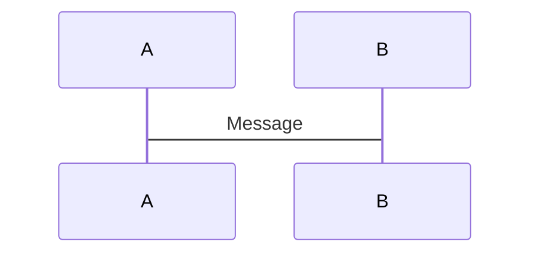
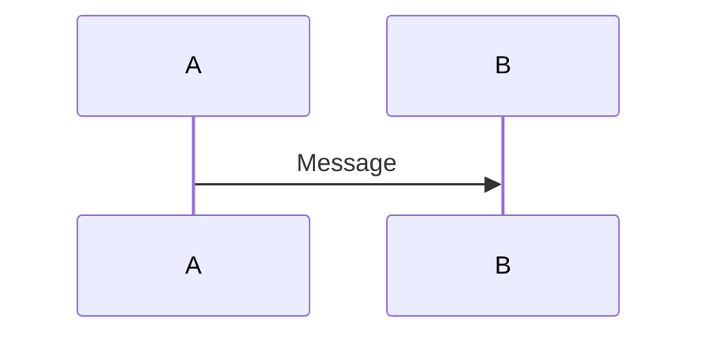
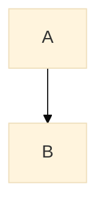
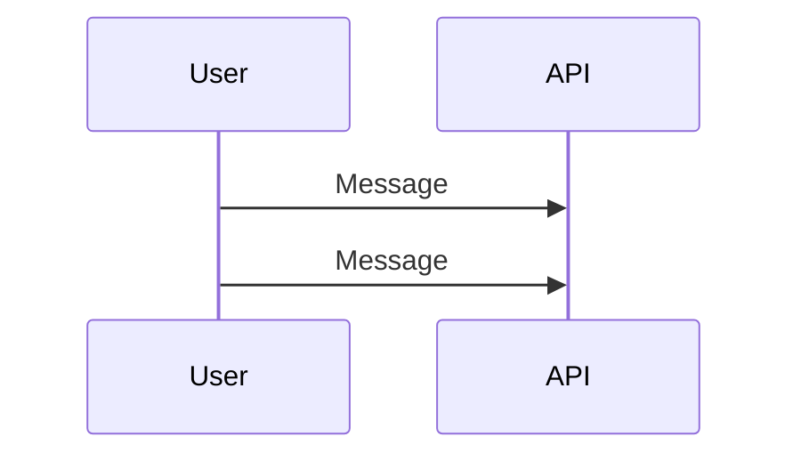

# Diagram-as-Code Troubleshooting Guide

Common issues, solutions, and debugging tips for diagram-as-code tools and workflows.

## Table of Contents

1. [Installation Issues](#installation-issues)
2. [Rendering Errors](#rendering-errors)
3. [Syntax Errors](#syntax-errors)
4. [Layout Problems](#layout-problems)
5. [Performance Issues](#performance-issues)
6. [Integration Issues](#integration-issues)
7. [Skill-Specific Errors](#skill-specific-errors)
8. [FAQ](#faq)

---

## Installation Issues

### D2: `command not found`

**Problem**:
```bash
$ d2 diagram.d2 output.png
bash: d2: command not found
```

**Solutions**:

**Option 1: Install via Go**
```bash
go install oss.terrastruct.com/d2@latest

# Add to PATH (add to ~/.bashrc or ~/.zshrc)
export PATH="$PATH:$HOME/go/bin"
source ~/.bashrc
```

**Option 2: Download binary**
```bash
# macOS (Homebrew)
brew install d2

# Linux (wget)
wget https://github.com/terrastruct/d2/releases/download/v0.7.1/d2-v0.7.1-linux-amd64.tar.gz
tar -xzf d2-v0.7.1-linux-amd64.tar.gz
sudo mv d2-v0.7.1/bin/d2 /usr/local/bin/
```

**Verify**:
```bash
d2 --version
# Output: v0.7.1
```

---

### Mermaid CLI: `mmdc: command not found`

**Problem**:
```bash
$ mmdc -i diagram.mmd -o output.png
bash: mmdc: command not found
```

**Solution**:
```bash
# Install globally via npm
npm install -g @mermaid-js/mermaid-cli

# Verify
mmdc --version
```

**Common Issue**: Node.js version too old

**Check Node version**:
```bash
node --version
# Required: v18.0.0 or later
```

**Update Node**:
```bash
# Using nvm
nvm install 18
nvm use 18
```

---

### Structurizr CLI: Java errors

**Problem**:
```bash
$ structurizr-cli validate workspace.dsl
Error: Java runtime not found
```

**Solution**:
```bash
# Check Java version (requires JDK 11+)
java -version

# Install Java (macOS)
brew install openjdk@17

# Install Java (Linux)
sudo apt-get install openjdk-17-jdk
```

---

## Rendering Errors

### D2: "Failed to render: layout engine not found"

**Problem**:
```bash
$ d2 diagram.d2 output.png
Error: layout engine "elk" not found
```

**Cause**: Missing layout engine binary

**Solution**:
```bash
# D2 bundles layout engines, reinstall D2
go install oss.terrastruct.com/d2@latest

# Or try different layout engine
d2 --layout dagre diagram.d2 output.png
```

---

### D2: "Syntax error: unexpected token"

**Problem**:
```bash
$ d2 diagram.d2 output.png
Error: syntax error at line 5: unexpected token '}'
```

**Cause**: Mismatched braces or invalid syntax

**Debug**:
```bash
# Dry run to check syntax only
d2 compile --dry-run diagram.d2

# Enable verbose output
d2 --debug diagram.d2 output.png
```

**Common Mistakes**:

**❌ Missing closing brace**:
```d2
User: {
  shape: person
# Missing }
```

**✅ Fixed**:
```d2
User: {
  shape: person
}
```

**❌ Invalid character in label**:
```d2
User@Domain  # @ is not allowed
```

**✅ Fixed**:
```d2
"User@Domain"  # Quote special characters
```

---

### Mermaid: "Parse error on line X"

**Problem**:
```bash
$ mmdc -i diagram.mmd -o output.png
Error: Parse error on line 3
```

**Cause**: Invalid Mermaid syntax

**Debug**:
1. Copy diagram to [Mermaid Live Editor](https://mermaid.live)
2. See real-time error highlighting
3. Fix syntax
4. Copy back to file

**Common Mistakes**:

**❌ Incorrect arrow syntax**:


**✅ Fixed**:


---

### Structurizr: "Validation failed"

**Problem**:
```bash
$ structurizr-cli validate workspace.dsl
Error: Validation failed: softwareSystem "System" not found
```

**Cause**: Reference to undefined element

**Solution**:
```
workspace {
  model {
    # Define before using
    system = softwareSystem "System"
    user = person "User"

    user -> system "Uses"  # Now valid
  }
}
```

---

## Syntax Errors

### D2: Invalid relationship syntax

**❌ Wrong**:
```d2
A --> B  # PlantUML syntax
```

**✅ Correct**:
```d2
A -> B  # D2 uses single arrow
```

---

### D2: Attribute syntax errors

**❌ Wrong**:
```d2
User: shape=person  # Wrong separator
```

**✅ Correct**:
```d2
User: {shape: person}  # Curly braces + colon
```

---

### D2: Multi-line description errors

**❌ Wrong**:
```d2
User: {
  description: This is a
  multi-line description  # Syntax error
}
```

**✅ Correct**:
```d2
User: {
  description: |md
    This is a
    multi-line description
  |
}
```

---

### Mermaid: Missing diagram type

**❌ Wrong**:
```mermaid
A --> B
```

**✅ Correct**:


---

## Layout Problems

### D2: Elements overlapping

**Problem**: Diagram elements overlap making it unreadable

**Solutions**:

**1. Change layout engine**:
```bash
# Try ELK (best for complex layouts)
d2 --layout elk diagram.d2 output.png

# Try Dagre (simpler, faster)
d2 --layout dagre diagram.d2 output.png

# Try TALA (experimental, aesthetic)
d2 --layout tala diagram.d2 output.png
```

**2. Adjust direction**:
```d2
direction: right  # Horizontal layout
# or
direction: down   # Vertical layout
```

**3. Manual positioning hints**:
```d2
User: {near: top-left}
Database: {near: bottom-right}
```

**4. Simplify diagram**:
- Split into multiple diagrams
- Remove unnecessary elements
- Group related items

---

### D2: Edges crossing unnecessarily

**Problem**: Relationship arrows cross each other

**Solution**:
```d2
# Use better layout engine
d2 --layout elk diagram.d2 output.png

# ELK minimizes edge crossings
```

---

### Mermaid: Vertical spacing too tight

**Problem**: Nodes are too close together

**Solution**:


---

## Performance Issues

### D2: Slow rendering for large diagrams

**Problem**: D2 takes >30 seconds to render

**Symptoms**:
- 50+ elements
- Many relationships
- Complex nested structures

**Solutions**:

**1. Use faster layout engine**:
```bash
# Dagre is faster than ELK
d2 --layout dagre diagram.d2 output.png
```

**2. Split diagram**:
```d2
# Instead of one huge diagram, create multiple focused diagrams
# c4-container.d2 (high-level)
# c4-component-api.d2 (detail)
# c4-component-db.d2 (detail)
```

**3. Simplify**:
- Remove unnecessary elements
- Consolidate similar components
- Use higher abstraction level

**4. Cache renders**:
```bash
# Only render if source changed
if [ diagram.d2 -nt rendered/diagram.png ]; then
  d2 diagram.d2 rendered/diagram.png
fi
```

---

### Mermaid: Browser rendering timeout

**Problem**: Mermaid diagram won't render in browser

**Solution**:
```javascript
// Increase timeout in config
mermaid.initialize({
  startOnLoad: true,
  maxTextSize: 100000,
  securityLevel: 'loose'
});
```

---

## Integration Issues

### CI/CD: Rendering fails in GitHub Actions

**Problem**:
```yaml
Error: d2: command not found
```

**Solution**:
```yaml
- name: Install D2
  run: |
    go install oss.terrastruct.com/d2@latest
    echo "$HOME/go/bin" >> $GITHUB_PATH

- name: Verify installation
  run: d2 --version
```

---

### CI/CD: Out of memory error

**Problem**:
```
Error: OOM (Out of Memory)
```

**Cause**: Rendering very large diagrams in CI

**Solution**:
```yaml
# Increase memory limit
- name: Render diagrams
  run: d2 --layout dagre diagram.d2 output.png
  env:
    NODE_OPTIONS: --max-old-space-size=4096
```

---

### Pre-commit hook: Permission denied

**Problem**:
```bash
.git/hooks/pre-commit: Permission denied
```

**Solution**:
```bash
chmod +x .git/hooks/pre-commit
```

---

### ImageMagick: "not authorized"

**Problem** (Visual regression testing):
```bash
$ compare baseline.png current.png diff.png
convert: not authorized `baseline.png'
```

**Cause**: ImageMagick security policy blocks PNG operations

**Solution**:
```bash
# Edit policy file
sudo vim /etc/ImageMagick-6/policy.xml

# Comment out PNG restriction
<!-- <policy domain="coder" rights="none" pattern="PNG" /> -->
```

---

## Skill-Specific Errors

### create-diagrams: "No components found"

**Problem**:
```bash
$ create-diagrams src/ diagrams/
Warning: No components found in codebase
```

**Causes**:
1. Wrong source directory
2. Unsupported language
3. No imports/dependencies

**Solutions**:

**1. Verify source path**:
```bash
# Check you're pointing to code, not docs
create-diagrams src/ diagrams/  # ✅ Code directory
create-diagrams docs/ diagrams/ # ❌ Documentation
```

**2. Specify language**:
```bash
create-diagrams src/ diagrams/ --language go
```

**3. Check for dependencies**:
```bash
# Must have imports/dependencies to detect
# Go: import statements
# Python: from/import statements
# TypeScript: import statements
```

---

### review-diagrams: "C4 validation failed"

**Problem**:
```bash
$ review-diagrams diagrams/c4-context.d2
Error: C4 Level 1 violation: Container found in Context diagram
```

**Cause**: Mixing C4 abstraction levels

**Solution**:
```d2
# Context diagram should only have Person and Software System
# ❌ Remove containers like "API Server", "Database"
# ✅ Keep only high-level systems

Customer: {shape: person}
E-Commerce Platform  # Software System
Payment Gateway      # External System
```

---

### diagram-sync: "Sync score 0%"

**Problem**:
```bash
$ diagram-sync diagrams/c4-container.d2 src/
Sync score: 0% (0/10 matched)
```

**Causes**:
1. Diagram names don't match code structure
2. Codebase path wrong
3. Naming convention mismatch

**Solutions**:

**1. Check naming**:
```d2
# Diagram uses "OrderService"
# Code has directory "order-service/"
# → Name mismatch!

# Fix: Use consistent naming
Order Service  # Fuzzy matching handles variations
```

**2. Verify codebase path**:
```bash
# Point to source code, not build output
diagram-sync diagrams/c4-container.d2 src/     # ✅
diagram-sync diagrams/c4-container.d2 build/   # ❌
```

**3. Check language detection**:
```bash
# Explicitly specify language
diagram-sync diagrams/c4-container.d2 src/ --language python
```

---

### render-diagrams: "Format not supported"

**Problem**:
```bash
$ render-diagrams diagram.xyz output.png
Error: Format .xyz not supported
```

**Cause**: Unsupported diagram format

**Supported Formats**:
- ✅ `.d2` (D2)
- ✅ `.dsl` (Structurizr DSL)
- ✅ `.mmd` or `.mermaid` (Mermaid)
- ✅ `.puml` (PlantUML - legacy)
- ❌ `.drawio`, `.visio`, etc.

**Solution**: Convert to supported format or use appropriate tool

---

## FAQ

### Q: Why is my diagram not updating?

**A**: Check for cached renders

```bash
# Clear cache and re-render
rm diagrams/rendered/*.png
d2 diagrams/*.d2 diagrams/rendered/

# Or use force flag (if available)
d2 --force diagram.d2 output.png
```

---

### Q: Can I use special characters in element names?

**A**: Yes, with quotes

```d2
# ❌ Won't work
User@Domain -> API

# ✅ Works
"User@Domain" -> API: "Uses HTTPS"
```

---

### Q: How do I add colors to elements?

**A**: Use `style.fill`

```d2
User: {
  style.fill: "#08427b"
  style.stroke: "#052e56"
  style.font-color: "#ffffff"
}
```

---

### Q: Can I include one diagram in another?

**A**: Depends on tool

**D2**: No direct include (yet)
- Workaround: Copy-paste or use code generation

**Structurizr**: Yes, via workspace
```
workspace {
  model {
    !include components/user-service.dsl
  }
}
```

**Mermaid**: No direct include
- Workaround: Template/build system

---

### Q: Why does GitHub not render my Mermaid diagram?

**A**: Check syntax and fence

````markdown
# ❌ Wrong
```
graph TD
    A --> B
```

# ✅ Correct

````

---

### Q: How do I export to PDF?

**A**: Render to SVG first, then convert

```bash
# D2 → SVG
d2 diagram.d2 diagram.svg

# SVG → PDF (using Inkscape)
inkscape diagram.svg --export-pdf=diagram.pdf

# Or use browser print-to-PDF
```

---

### Q: Can I use custom fonts?

**A**: Tool-dependent

**D2**: Respects system fonts
```d2
User: {
  style.font: "Comic Sans MS"  # If installed
}
```

**Mermaid**: CSS overrides
```css
.mermaid {
  font-family: 'Arial', sans-serif;
}
```

---

### Q: How do I debug layout issues?

**A**: Use verbose output

```bash
# D2 debug mode
d2 --debug diagram.d2 output.png

# Shows layout engine decisions
```

---

### Q: Why is my sequence diagram broken?

**A**: Check actor definitions



---

### Q: Can I use icons/images?

**A**: Yes (D2 and Structurizr)

**D2**:
```d2
EC2: {
  icon: https://icons.terrastruct.com/aws/Compute/EC2.svg
}

# Or local file
Database: {
  icon: ./icons/postgresql.svg
}
```

---

### Q: How do I handle very long labels?

**A**: Use multi-line text

```d2
User: {
  label: |md
    Customer
    (External User)
  |
}
```

---

## Debugging Checklist

When a diagram isn't working:

- [ ] **Check syntax**: Run `d2 compile --dry-run diagram.d2`
- [ ] **Check tool version**: `d2 --version`, `mmdc --version`
- [ ] **Try simple example**: Create minimal test diagram
- [ ] **Check error message**: Read full error output
- [ ] **Verify file path**: Absolute paths to avoid confusion
- [ ] **Clear cache**: Remove `rendered/` directory
- [ ] **Try different layout**: `--layout dagre` vs `--layout elk`
- [ ] **Check permissions**: `chmod +x` if needed
- [ ] **Update tools**: `go install oss.terrastruct.com/d2@latest`
- [ ] **Search issues**: GitHub issues for d2/mermaid/structurizr
- [ ] **Ask for help**: Include error message + diagram code

---

## Getting Help

**D2**:
- [GitHub Issues](https://github.com/terrastruct/d2/issues)
- [Discord Community](https://discord.gg/NF6X8K4eDq)

**Mermaid**:
- [GitHub Issues](https://github.com/mermaid-js/mermaid/issues)
- [Live Editor](https://mermaid.live) for testing

**Structurizr**:
- [Documentation](https://docs.structurizr.com)
- [Slack Community](https://structurizr.com/help/support)

**Engram Skills**:
- [GitHub Issues](https://github.com/anthropics/engram/issues)
- Skill documentation in `skills/*/SKILL.md`

---

**Document Version**: 1.0
**Last Updated**: 2026-03-13
**Maintained by**: Engram Team
