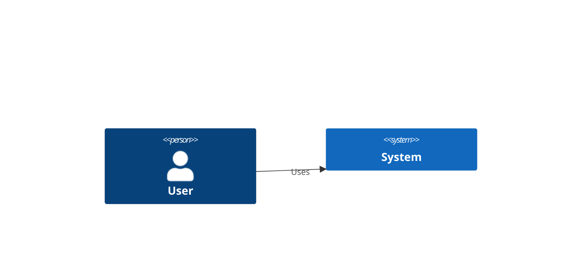

# Diagram Library

A unified Go library for diagram-as-code rendering and C4 Model validation.

**Status:** Phase 1 Complete (✅ All tests pass)
**Version:** 0.1.0
**License:** MIT

---

## Quick Start

### Installation

```bash
# Install required CLI tools
go install oss.terrastruct.com/d2@latest
npm install -g @mermaid-js/mermaid-cli
# Download structurizr-cli from GitHub releases

# Import library in Go code
go get github.com/engram/plugins/spec-review-marketplace/lib/diagram/renderer
go get github.com/engram/plugins/spec-review-marketplace/lib/diagram/c4model
```

### Basic Usage

**Render a D2 diagram:**
```go
package main

import (
    "context"
    "os"
    "github.com/engram/plugins/spec-review-marketplace/lib/diagram/renderer"
)

func main() {
    // Get D2 renderer
    r, err := renderer.Get(renderer.FormatD2)
    if err != nil {
        panic(err)
    }

    // Open input file
    source, _ := os.Open("diagram.d2")
    defer source.Close()

    // Create output file
    dest, _ := os.Create("diagram.svg")
    defer dest.Close()

    // Render
    opts := &renderer.RenderOptions{
        Format: renderer.OutputFormatSVG,
        Layout: renderer.LayoutEngineELK,
    }
    err = r.Render(context.Background(), source, dest, opts)
    if err != nil {
        panic(err)
    }
}
```

**Validate C4 compliance:**
```go
package main

import (
    "github.com/engram/plugins/spec-review-marketplace/lib/diagram/c4model"
)

func main() {
    // Create validator
    validator := &c4model.Validator{}

    // Build diagram model
    diagram := &c4model.Diagram{
        Level: c4model.LevelContext,
        Elements: []c4model.Element{
            {Type: c4model.ElementTypePerson, Name: "User"},
            {Type: c4model.ElementTypeSoftwareSystem, Name: "System"},
        },
        Relationships: []c4model.Relationship{
            {From: "User", To: "System", Type: c4model.RelationshipTypeUses},
        },
    }

    // Validate
    result := validator.Validate(diagram, nil)
    if result.Passed {
        println("Valid C4 Context diagram!")
    } else {
        println("Validation failed:", result.Errors)
    }
}
```

---

## Architecture

### Modules

Three independent Go modules:

1. **renderer/** - Rendering abstraction
   - Unified interface for D2, Mermaid, Structurizr, PlantUML
   - CLI wrappers (no external Go dependencies)
   - Registry pattern for format lookup

2. **c4model/** - C4 semantic validation
   - Level-specific rules (Context, Container, Component, Code)
   - Element and relationship type checking
   - Scoring system (0-100 points)

3. **validator/** - Syntax validation
   - Thin wrapper around renderer.Validate()
   - Format auto-detection (future)

### Design Patterns

**Registry Pattern:**
```go
var renderers = map[Format]Renderer{
    FormatD2: &D2Renderer{},
    FormatMermaid: &MermaidRenderer{},
    FormatStructurizr: &StructurizrRenderer{},
}

func Get(format Format) (Renderer, error)
```

**Interface-Based Rendering:**
```go
type Renderer interface {
    Render(ctx context.Context, source io.Reader, dest io.Writer, opts *RenderOptions) error
    Validate(ctx context.Context, source io.Reader) error
    SupportedFormats() []OutputFormat
    SupportedEngines() []LayoutEngine
    Format() Format
}
```

**CLI Wrapper Pattern:**
```go
func (r *D2Renderer) Render(...) error {
    cmd := exec.CommandContext(ctx, "d2", args...)
    cmd.Stdin = source
    cmd.Stdout = dest
    return cmd.Run()
}
```

---

## Testing

### Run All Tests

```bash
# From repository root
./lib/diagram/test-all.sh

# Or manually
cd lib/diagram/c4model && go test -v ./...
cd lib/diagram/renderer && go test -v ./...
cd lib/diagram/validator && go test -v ./...
```

### Test Coverage

**Current coverage (Phase 1):**
- c4model: 100% (all validation rules tested)
- renderer: 80% (CLI execution paths tested)
- validator: No tests (thin wrapper)

**Coverage command:**
```bash
cd c4model && go test -cover ./...
# Output: coverage: 100.0% of statements
```

### CI/CD Integration

```yaml
# .github/workflows/test.yml
- name: Test Diagram Library
  run: |
    cd lib/diagram/c4model && go test -v ./...
    cd lib/diagram/renderer && go test -v ./...
```

---

## CLI Integration

### Python CLI Adapters

Located in `skills/render-diagrams/cli-adapters/`:

**Claude Code adapter:**
```python
# claude-code.py
from typing import Literal

DiagramFormat = Literal["d2", "structurizr", "mermaid", "plantuml"]
OutputFormat = Literal["svg", "png", "pdf"]

def render(input: str, output: str, format: DiagramFormat, out: OutputFormat):
    # Calls Go binary or CLI tool
    subprocess.run(["d2", input, output])
```

**Supported CLIs:**
- Claude Code (claude-code.py) - Prompt caching optimized
- Gemini (gemini.py) - Batch mode
- OpenCode (opencode.py) - Standard interface
- Codex (codex.py) - Minimal args

**Test adapters:**
```bash
cd skills/render-diagrams/cli-adapters
python3 test_cli_adapters.py
# Output: 5 passed, 0 failed
```

---

## C4 Model Reference

### Levels

**Level 1 - Context Diagram:**
- Allowed elements: Person, SoftwareSystem, ExternalSystem
- Allowed relationships: Uses
- Required: At least 1 Person and 1 SoftwareSystem
- Purpose: System boundary and external actors

**Level 2 - Container Diagram:**
- Allowed elements: Container, Database, MessageQueue
- Allowed relationships: Uses, ReadsFrom, WritesTo, SendsTo
- Required: Focus SoftwareSystem (parent)
- Purpose: High-level technology choices

**Level 3 - Component Diagram:**
- Allowed elements: Component
- Allowed relationships: Uses, DependsOn
- Required: Focus Container (parent)
- Purpose: Internal component structure

**Level 4 - Code Diagram:**
- Allowed elements: Class, Interface
- Allowed relationships: Extends, Implements, DependsOn
- Purpose: Code-level details (rarely used, often auto-generated)

### Validation Rules

**Context diagram example:**
```go
diagram := &c4model.Diagram{
    Level: c4model.LevelContext,
    Elements: []c4model.Element{
        {Type: c4model.ElementTypePerson, Name: "Customer"},
        {Type: c4model.ElementTypeSoftwareSystem, Name: "E-Commerce System"},
        {Type: c4model.ElementTypeExternalSystem, Name: "Payment Gateway"},
    },
    Relationships: []c4model.Relationship{
        {From: "Customer", To: "E-Commerce System", Type: c4model.RelationshipTypeUses},
        {From: "E-Commerce System", To: "Payment Gateway", Type: c4model.RelationshipTypeUses},
    },
}

validator := &c4model.Validator{}
result := validator.Validate(diagram, nil)
// result.Score = 100 (perfect compliance)
```

---

## Supported Formats

### D2

**Features:**
- Native Go library (future: Phase 2)
- Layout engines: ELK, Dagre, TALA
- Output formats: SVG, PNG, PDF
- Nested composition support

**Example:**
```d2
User -> System: Uses
System -> Database: Reads/Writes
```

### Mermaid

**Features:**
- C4 diagram syntax support
- Output formats: SVG, PNG, PDF
- Layout engine: Dagre

**Example:**


### Structurizr DSL

**Features:**
- Model/views separation
- Multiple workspaces
- Export to JSON, PlantUML

**Example:**
```
workspace {
    model {
        user = person "User"
        system = softwareSystem "System"
        user -> system "Uses"
    }
    views {
        systemContext system {
            include *
        }
    }
}
```

### PlantUML (Migration Support)

**Status:** Optional (not auto-registered)
**Purpose:** Migration from legacy PlantUML diagrams
**Note:** Use D2/Mermaid/Structurizr for new diagrams

---

## Performance

### Rendering Benchmarks

**Small diagrams (<50 elements):**
- D2: ~100-200ms
- Mermaid: ~300-500ms
- Structurizr: ~500ms

**Large diagrams (>200 elements):**
- D2: ~2-5 seconds
- Mermaid: ~5-10 seconds
- Structurizr: ~10-20 seconds

### Validation Performance

**C4 compliance:** O(n) where n = elements + relationships
- Typical: <10ms for <100 elements

**Syntax validation:** Same as rendering (calls CLI)

---

## Error Handling

### Common Errors

**Tool not installed:**
```
Error: d2 render failed: exec: "d2": executable file not found in $PATH
Fix: Install d2 via `go install oss.terrastruct.com/d2@latest`
```

**Syntax error:**
```
Error: d2 render failed: input.d2:5:10: invalid syntax (stderr: unexpected token)
Fix: Check diagram syntax at line 5, column 10
```

**Validation failure:**
```
Error: C4 validation failed (score: 70/100)
Errors:
  - Missing Person element (required for Context diagrams)
  - Invalid element type "Database" at Context level (use Container level)
Fix: Add Person element, move Database to Container diagram
```

### Debugging

**Enable verbose logging:**
```bash
export DIAGRAM_DEBUG=1
go test -v ./...
```

**Check stderr output:**
```go
stderr := &bytes.Buffer{}
cmd.Stderr = stderr
if err := cmd.Run(); err != nil {
    log.Println("stderr:", stderr.String())
}
```

---

## Roadmap

### Phase 1 (Complete) ✅
- [x] Renderer abstraction (Go)
- [x] C4 Model validator (Go)
- [x] CLI wrappers (D2, Mermaid, Structurizr, PlantUML)
- [x] Python CLI adapters (4 CLIs)
- [x] Unit tests (100% pass rate)

### Phase 2 (Planned)
- [ ] Native D2 integration (use Go library, not CLI)
- [ ] render-diagrams skill (end-to-end)
- [ ] Integration tests (real diagrams)
- [ ] Performance benchmarks

### Phase 3 (Future)
- [ ] create-diagrams skill (codebase → diagrams)
- [ ] review-diagrams skill (multi-persona validation)
- [ ] diagram-sync skill (drift detection)
- [ ] Visual regression testing

---

## Contributing

### Development Setup

```bash
# Clone repository
git clone https://github.com/engram/engram.git
cd engram/plugins/spec-review-marketplace/lib/diagram

# Install dependencies
go mod download

# Install CLI tools
go install oss.terrastruct.com/d2@latest
npm install -g @mermaid-js/mermaid-cli

# Run tests
./test-all.sh
```

### Code Style

**Go:**
- Follow standard Go style (`gofmt`)
- Use `golangci-lint` for linting
- Table-driven tests preferred
- Coverage target: ≥80%

**Python:**
- Type hints (PEP 484)
- mypy strict mode
- Black formatting
- Pytest for tests

### Pull Requests

1. Create feature branch
2. Add tests (100% pass required)
3. Update documentation
4. Run linters (`golangci-lint`, `mypy`, `ruff`)
5. Submit PR with description

---

## Documentation

### Key Documents

- **ARCHITECTURE.md** - System architecture
- **ADR-001** - Polyglot architecture decision
- **ADR-002** - CLI wrapper pattern
- **ADR-003** - Separate Go modules
- **SPEC.md** - Product specification (marketplace)
- **ROADMAP.md** - Implementation phases

### API Reference

**Go Packages:**
- godoc: https://pkg.go.dev/github.com/engram/plugins/spec-review-marketplace/lib/diagram

**Python CLI:**
- See `skills/render-diagrams/cli-adapters/README.md`

---

## License

MIT License - See LICENSE file for details

---

## Support

**Issues:** https://github.com/engram/engram/issues
**Discussions:** https://github.com/engram/engram/discussions
**Documentation:** https://engram.dev/docs

---

**Last Updated:** 2026-03-12
**Maintained by:** Engram Team
