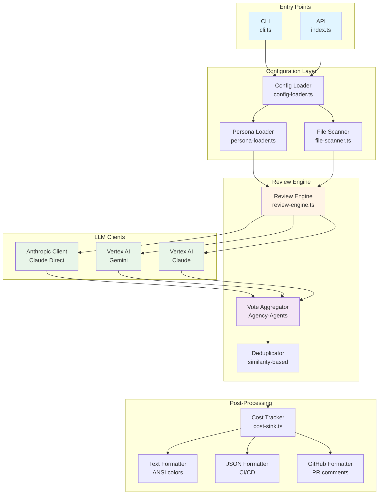
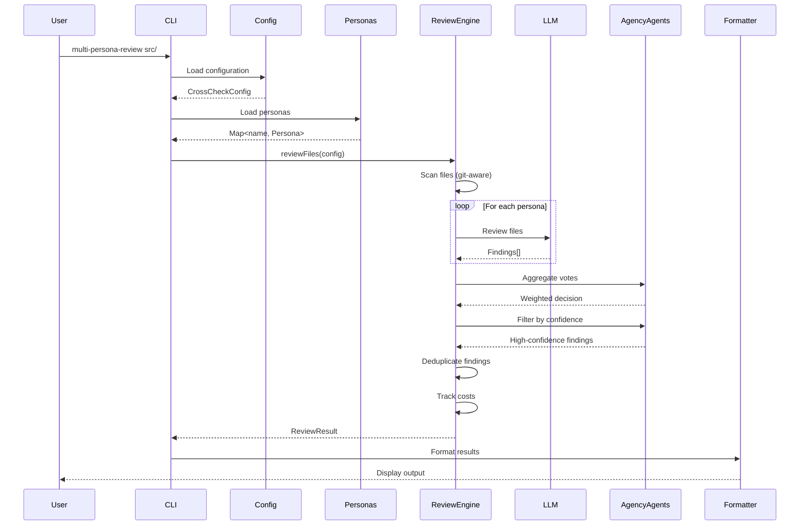
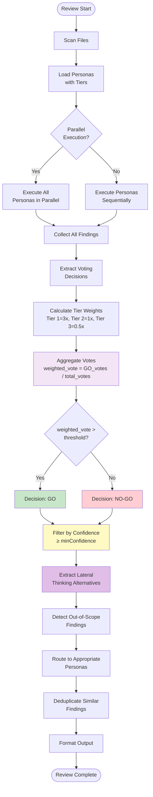
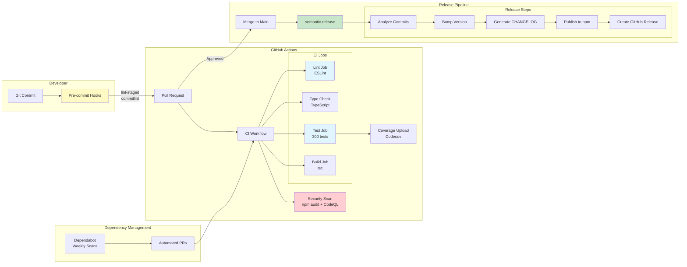
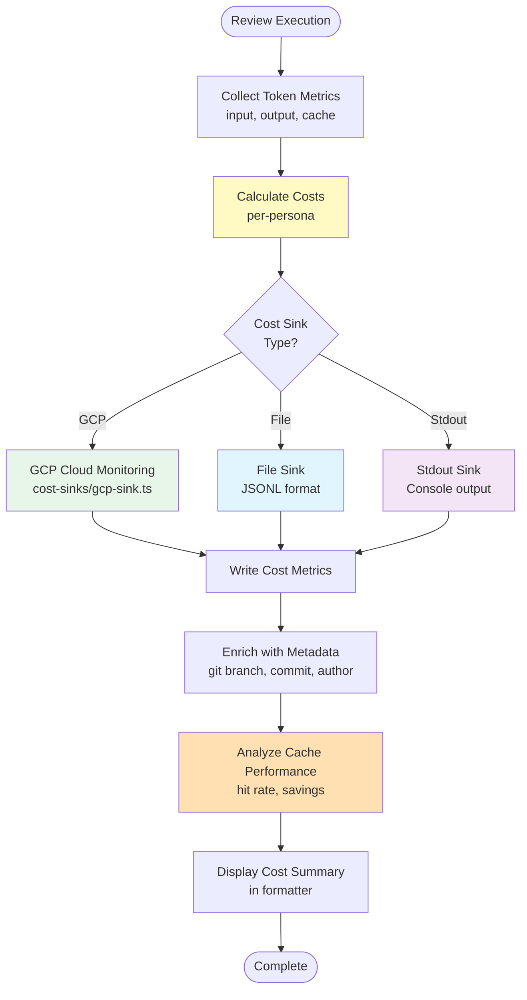
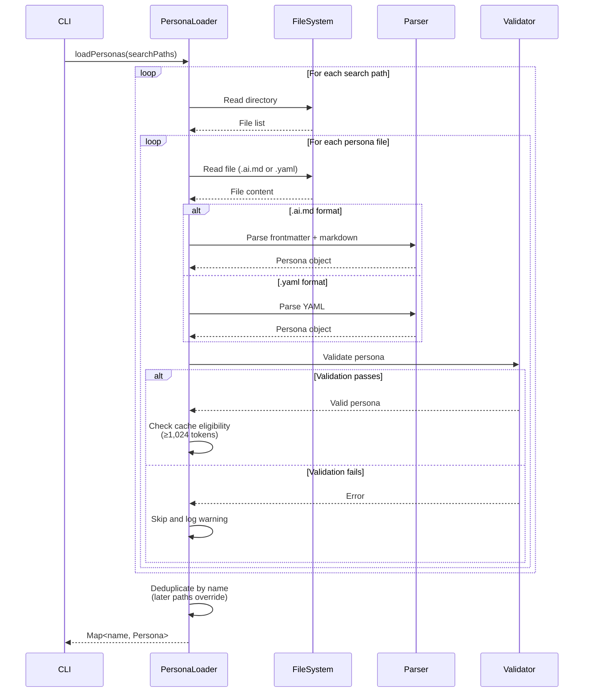
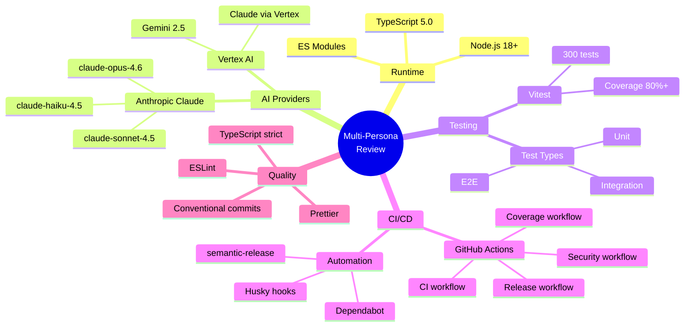
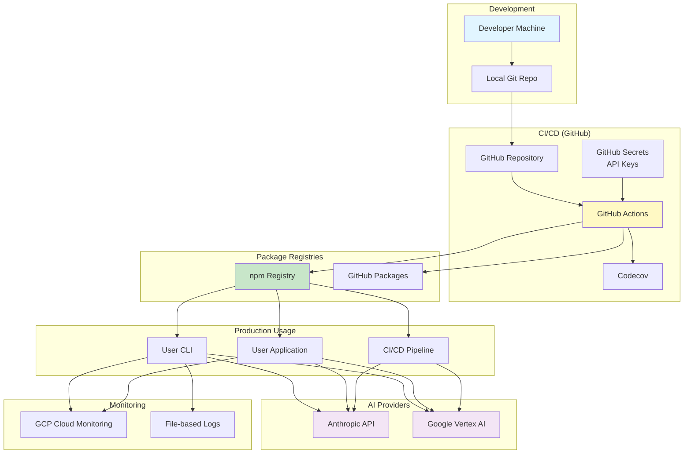

# Architecture Diagrams

This document provides visual representations of the Multi-Persona Review architecture using Mermaid diagrams.

## Table of Contents

- [System Architecture](#system-architecture)
- [Data Flow](#data-flow)
- [Agency-Agents Flow](#agency-agents-flow)
- [CI/CD Pipeline](#cicd-pipeline)
- [Cost Tracking Flow](#cost-tracking-flow)
- [Persona Loading Sequence](#persona-loading-sequence)

---

## System Architecture

---

## Data Flow

---

## Agency-Agents Flow

---

## CI/CD Pipeline

---

## Cost Tracking Flow

---

## Persona Loading Sequence

---

## Component Interaction Matrix

| Component | Depends On | Used By | Purpose |
|-----------|------------|---------|---------|
| **CLI** | Config, Persona, ReviewEngine | User | Entry point for command-line usage |
| **API** | Config, Persona, ReviewEngine | Applications | Entry point for programmatic usage |
| **Config Loader** | FileSystem, YAML parser | CLI, API | Load and validate configuration |
| **Persona Loader** | FileSystem, YAML parser | CLI, API | Load and validate personas |
| **File Scanner** | Git, FileSystem | ReviewEngine | Scan files for review |
| **Review Engine** | Persona, FileScanner, LLM Client | CLI, API | Orchestrate review execution |
| **Vote Aggregator** | ReviewEngine | ReviewEngine | Agency-Agents vote aggregation |
| **LLM Clients** | Anthropic/Vertex AI APIs | ReviewEngine | Execute AI reviews |
| **Deduplicator** | ReviewEngine | ReviewEngine | Merge similar findings |
| **Cost Tracker** | ReviewEngine | Formatters | Track and report costs |
| **Formatters** | ReviewEngine | CLI, API | Format output for display |

---

## Technology Stack

---

## Deployment Architecture

---

## Performance Optimization Points

```mermaid
flowchart LR
    Input[Code Files] --> Scan[File Scanning]

    Scan --> Optimize1{Optimization Point 1:<br/>Parallel Execution}

    Optimize1 -->|3x faster| ParallelPersonas[Execute Personas<br/>in Parallel]

    ParallelPersonas --> Optimize2{Optimization Point 2:<br/>Prompt Caching}

    Optimize2 -->|86% cost savings| CachedReview[Use Cached<br/>Persona Prompts]

    CachedReview --> Optimize3{Optimization Point 3:<br/>Deduplication}

    Optimize3 -->|50% noise reduction| DedupFindings[Deduplicate<br/>Similar Findings]

    DedupFindings --> Optimize4{Optimization Point 4:<br/>Confidence Filtering}

    Optimize4 -->|High-quality only| FilteredFindings[Filter Low-Confidence<br/>Findings]

    FilteredFindings --> Output[Final Results]

    style Optimize1 fill:#fff9c4
    style Optimize2 fill:#c8e6c9
    style Optimize3 fill:#e1bee7
    style Optimize4 fill:#ffcdd2
```

---

## See Also

- [ARCHITECTURE.md](../ARCHITECTURE.md) - Detailed architecture documentation
- [SPEC.md](../SPEC.md) - Functional specification
- [README.md](../README.md) - Overview and quick start
